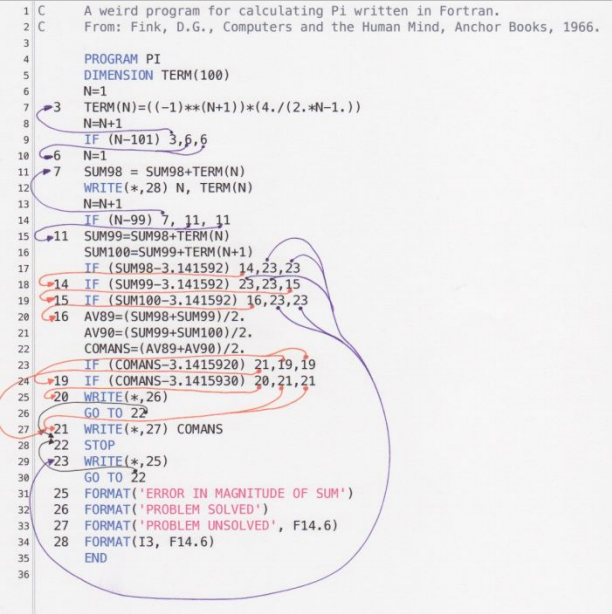

# Clase 2 _¿Qué resuelve la Programación Orientada a Objetos?_

En la clase anterior ya vimos cuán importante es la POO, así que ahora
aprenderemos un poco lo que nos resuelve la Programación Orientada a Objetos.

Primeramente, si estas comenzando este curso de seguro vienes del curso
Programación Estructurada donde estuviste aprendiendo a programar con C,
resolviendo problemas con un lenguaje de programa generada de forma secuencial,
es decir, una línea tras otra tras otra. Esencialmente la Programación Orientada
a Objetos se dedica a resolver mucho de los huecos que la programación
estructurada nos dejó en el camino. No es del todo malo, sino que a medida que
van creciendo los problemas te darás cuenta que necesitamos reutilizar código,
que sea más corto, que resuelva muchos problemas que la programación
estructurada nos está dejando en el camino, y por supuesto la POO nace de todos
los problemas dejados por la programación estructurada.

**Problemas de la Programación Estructurada**

- **Código muy largo:** Nos resuelve los códigos largos, extremadamente largo.
  Tal vez en el curso anterior no lo notamos porque la dimensión del proyecto
  debió ser la adecuada para aprender lo suficiente sobre la programación
  estructurada, pero a medida que un sistema va creciendo y se va haciendo más
  robusta, el código que genera la Programación Estructurada es extremadamente
  largo de tal forma que los programadores vintage, aquellos programadores
  acostumbrados a la Programación Estructurada con lenguajes como COBOL,
  FORTRAN, esos lenguajes muy estructurados hacía que estos tipos de
  programadores cobraran literalmente por línea de código (hoy sabemos que
  cobrar por línea de código es una locura), y al tener tantas líneas de código
  nos dejaba con programas que tuvieran 3000 o 4000 líneas. Y esto hacía que sea
  difícil entender, leer, analizar o depurar algún bug teniendo un código de
  esta forma.
- **Si algo falla, todo se rompe:** Otro problema de la Programación
  Estructurada es que, como se ejecuta una línea tras otra secuencialmente, si
  algo sucedía en el camino el programa tronaba. Si algo no funcionaba todo se
  rompía. El programa tronaba absolutamente, no había forma de salvarlo, y
  entonces todo lo que seguía después de la línea que rompía el código ya no se
  ejecutaba.
- **Difícil de mantener:** Por supuesto, teniendo un código muy largo y si algo
  fallaba o se rompía, era muy difícil de mantener.

**Código Espagueti**

El código espagueti es un término "despectivo" que se utiliza para los programas
de computación que tienen una estructura de control de flujo compleja e
incomprensible. Su nombre deriva del hecho que este tipo de código parece
asemejarse a un plato de espaguetis, es decir, un montón de hilos intrincados y
anudados.

Tradicionalmente suele asociarse este estilo de programación con lenguajes
básicos y antiguos, donde el flujo se controlaba mediante sentencias de control
muy primitivas como GOTO y utilizando números de línea.

Muchos programadores consideran que escribir código espagueti es un verdadero
desastre, pero lo cierto es que no tiene nada de malo, si esto permite a la
persona entender la comprensión del problema, lo inadecuado sería considerar que
ese código está terminado. Lo más importante es utilizar la refactorización, es
decir iterar sobre varios repasos del código.

Podemos decir que lo importante es ir de más a menos, en un principio el código
espagueti puede ser la base enredada de lo que se quiere programar, pero al
momento de refactorizar, se tendrá que ser cada vez más específico.

Un ejemplo del Código Espagueti:

Los Callback Hell también podrían considerarse como Códigos Espaguetis:

