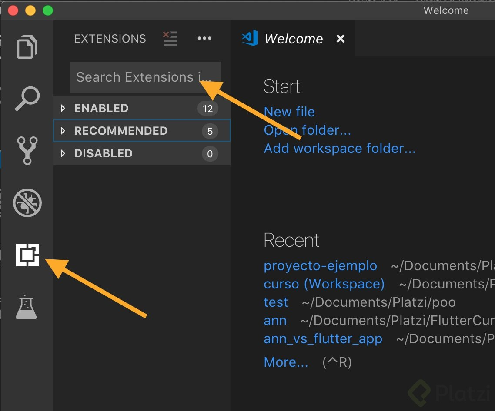
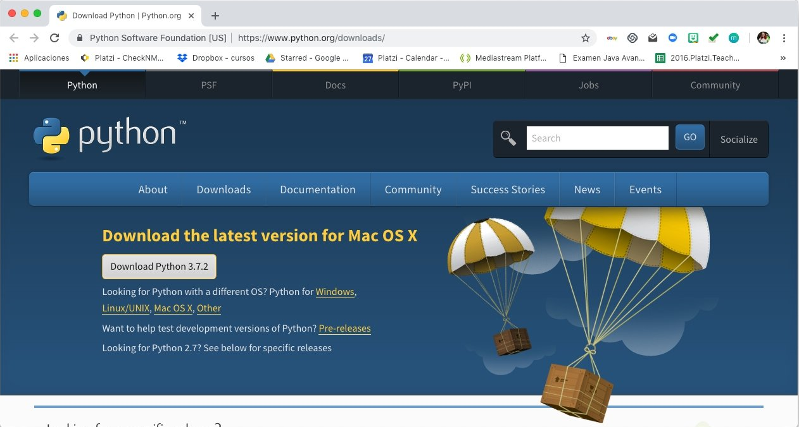
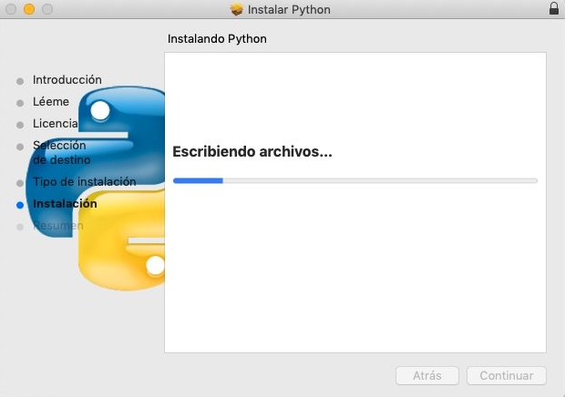
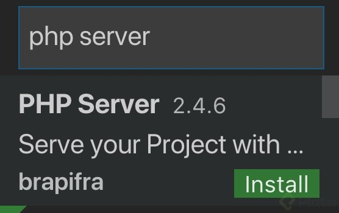
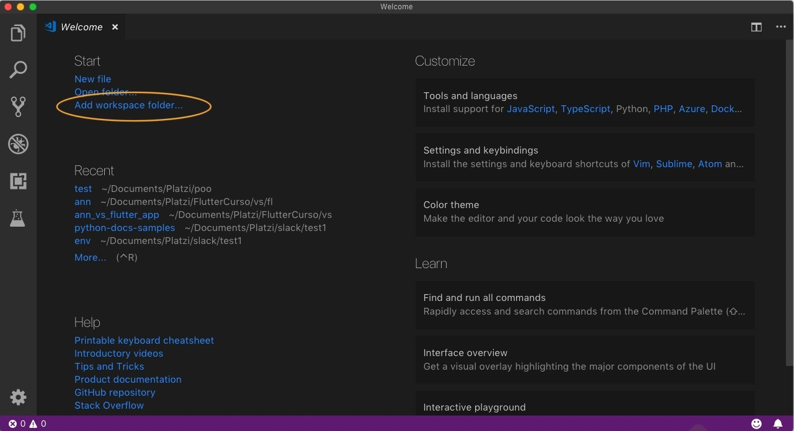
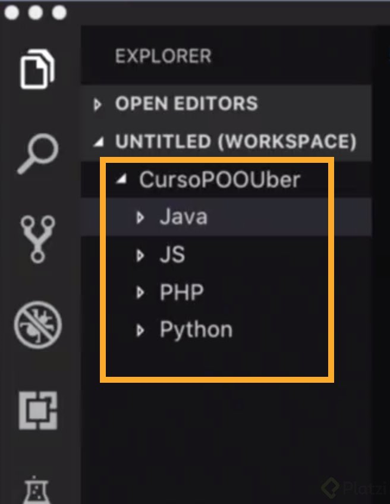

# Clase 5 _Instalando Visual Studio Code_

Pues que comience la aventura y digo aventura porque te darás cuenta de lo
emocionante que será poder trabajar 4 lenguajes de programación en un solo
entorno de desarrollo y sí, precisamente eso es lo que nos resuelve Visual
Studio Code el cual será nuestro campeón en este curso.

Visual Studio Code lo puedes encontrar en las tres versiones básicas de Sistema
Operativo (Windows, Mac y Linux) y lo puedes descargar directo en este enlace:
https://code.visualstudio.com/download. Es muy ligero y basta con un Siguiente,
siguiente, siguiente para instalar.

Cuando la instalación haya finalizado verás algo como esto:

¡Súper! Todo salió bien. Ahora pasemos a configurarlo para cada lenguaje.

Primero ubica la sección de Extensiones o en inglés Extensions, además de la
barra de Search porque estaremos buscando la extensión para cada lenguaje.

**Java**

En la barra de Search Extensions escribe: Java Extension Pack y da clic en el
botón verde Install.

Ahora, para tener una mejor experiencia en Debugging, instala el Debugger for
Java, el cual encuentras siguiendo el procedimiento anterior.

Listo, terminamos con Java. Aprende más en este
[enlace](https://code.visualstudio.com/docs/languages/java "enlace").

Ahora vamos por Python.

**Python**

Comencemos instalando Python en nuestra computadora. Dirígete al sitio
python.org y dale clic en el botón de Descargar.

Ve de la mano con el asistente hasta finalizar la instalación:

Terminaremos la configuración de Python en Visual Studio Code más adelante.
Aprende más
[aquí](https://code.visualstudio.com/docs/python/python-tutorial "aquí").

Mientras tanto sigamos con PHP.

**PHP**

Para configurar PHP buscaremos la extensión **PHP Server** y pulsamos Instalar

**JavaScript**

En este caso no necesitamos instalar absolutamente nada, utilizaremos el editor
con su configuración por defecto.

Comencemos nuestro proyecto

Ya está todo listo, ahora dejemos creado el proyecto.

Para esto seleccionaremos la opción Add workspace folder

A continuación creamos una carpeta llamada CursoPOOUber y damos clic en Add para
finalizar. Ahora generemos esta estructura de carpetas para manejar los
documentos correspondientes al lenguaje de programación:

Ahora que tenemos listo nuestro sistema de archivos terminemos la configuración
de Python en VSC, vamos al menú View -> Command Palette y escribimos python
“Seleccionar intérprete”, tal como se muestra en la figura.

¡Ya terminamos, estamos listos!
