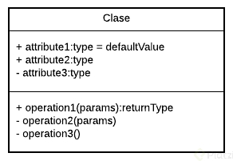
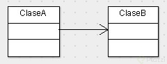
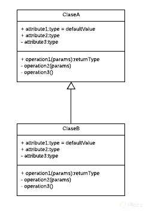
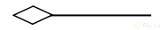
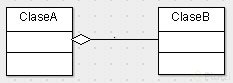
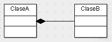

# Clase 7 *UML*

Como ya viste UML significa Unified Modeling Language el cual es un lenguaje estándar de modelado de sistemas orientados a objetos.

Esto significa que tendremos una manera gráfica de representar una situación, justo como hemos venido viendo. A continuación te voy a presentar los elementos que puedes utilizar para hacer estas representaciones.

Las clases se representan así:

En la parte superior se colocan los atributos o propiedades, y debajo las operaciones de la clase. Notarás que el primer carácter con el que empiezan es un símbolo. Este denotará la visibilidad del atributo o método, esto es un término que tiene que ver con Encapsulamiento y veremos más adelante a detalle.

Estos son los niveles de visibilidad que puedes tener:

- private -
- public +
- protected #
- default ~

Una forma de representar las relaciones que tendrá un elemento con otro es a través de las flechas en UML, y aquí tenemos varios tipos, estos son los más comunes:

**Asociación**

Como su nombre lo dice, notarás que cada vez que esté referenciada este tipo de flecha significará que ese elemento contiene al otro en su definición. La flecha apuntará hacia la dependencia.

Con esto vemos que la ClaseA está asociada y depende de la ClaseB.

**Herencia**

Siempre que veamos este tipo de flecha se estará expresando la herencia.

La dirección de la flecha irá desde el hijo hasta el padre.

Con esto vemos que la ClaseB hereda de la ClaseA

**Agregación**

Este se parece a la asociación en que un elemento dependerá del otro, pero en este caso será: Un elemento dependerá de muchos otros. Aquí tomamos como referencia la multiplicidad del elemento. Lo que comúnmente conocerías en Bases de Datos como Relaciones uno a muchos.

Con esto decimos que la ClaseA contiene varios elementos de la ClaseB. Estos últimos son comúnmente representados con listas o colecciones de datos.

**Composición**

Este es similar al anterior solo que su relación es totalmente compenetrada de tal modo que conceptualmente una de estas clases no podría vivir si no existiera la otra.

Con esto terminamos nuestro primer módulo. Vamos al siguiente para entender cómo podemos hacer un análisis y utilizar estos elementos para construir nuestro diagrama de clases de Uber.