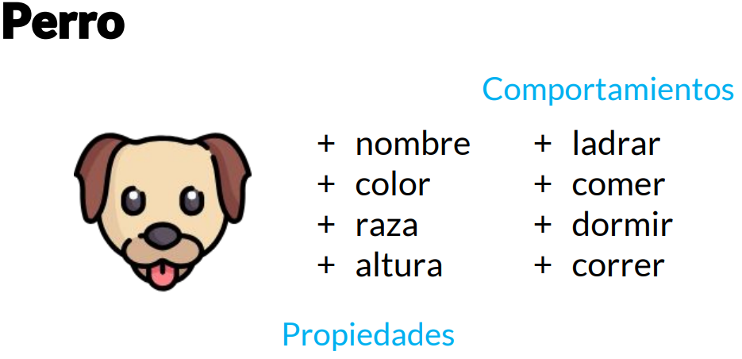
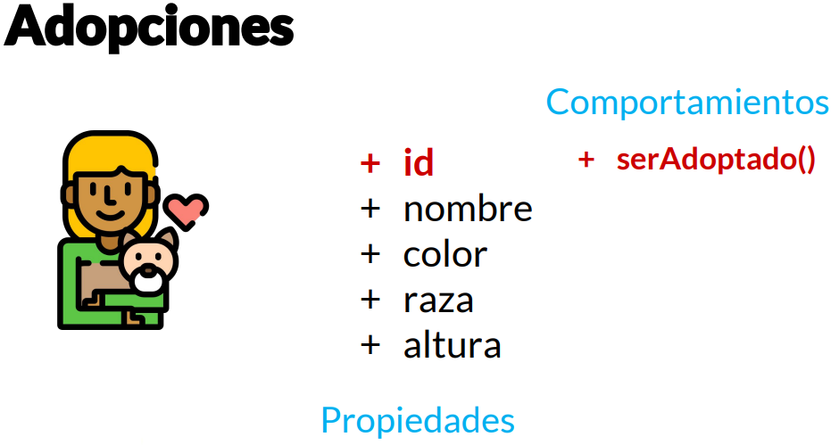

# Clase 8 *Objetos*

Sabemos que la programación Orientada a Objetos lo que hace es modelar los problemas para ayudarnos a plasmarlos en código. Esto es específicamente lo que debemos hacer: cuando tenemos un problema lo primero es identificar los objetos, y aquí viene la primera fase que es la parte de los análisis.

Tenemos que identificar los objetos. Cuando nosotros tenemos un problema de software es muy natural, que si somos programadores, irnos directamente al código sin interesarnos de donde provienen los datos o su comportamiento. Lo que debemos hacer es observar nuestro problema, identificando los objetos involucrados.

**¿Como identifico los objetos?**

Los objetos son aquellos que tienen propiedades y comportamientos, también serán sustantivos. Estos pueden ser físicos o conceptuales, por ejemplo, un objeto User es físico mientras que un objeto Session es conceptual. Ambos tienen propiedades y comportamientos.

Esa también es otra manera de identificarlos, analizando si poseen atributos y comportamientos.

**Propiedades**

Las propiedades, también llamado atributos, siempre serán sustantivos. Son las características que posee el objeto como el nombre, tamaño, forma, estado, etc.

Cuando estés analizando un objeto es un error común poner el resultado en lugar del atributo. Por ejemplo, puedes poner o decir que el atributo es Verde cuando en realidad debe ser color o decir que el atributo es Anahí Salgado cuando en realidad es nombre.

**Comportamientos**

Son todas las operaciones que el objeto puede hacer, suelen ser verbos o sustantivos y verbo.

Un objeto «User» puede hacer login() o logout, mientras que un objeto «Archivo» puede hacer makeReport().

**EJEMPLO**

Para nuestro ejemplo tenemos al objeto «Perro» con propiedades y comportamientos. Sin embargo, para entenderlo mejor, debemos verlo en un contexto diferente, y esto es importante a la hora de plasmar un código; ver el contexto de nuestros objetos.

Imaginemos lo siguiente: Tenemos un sistema de adopciones con un catálogo de perros disponibles a ser adoptados. El contexto cambiaria así como también lo haría como algunas propiedades o comportamiento.

Primero necesitaríamos un identificador único para diferenciar cada perro, porque pueden tener el mismo nombre o raza o color. Además de que nuestro comportamiento cambiaria, dentro del contexto de adopciones no nos importaría que el perro pueda ladrar, comer o correr, solo importaría si están disponibles para ser adoptados o no.