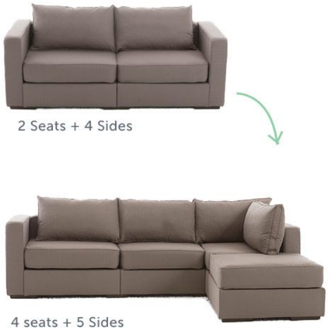
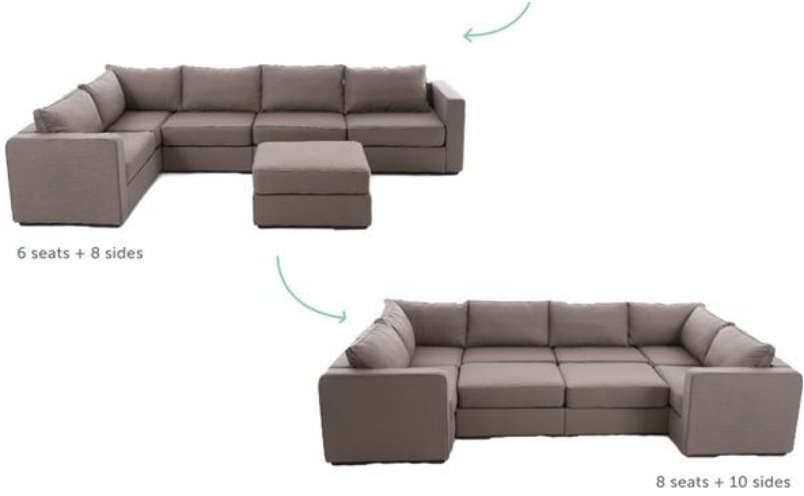
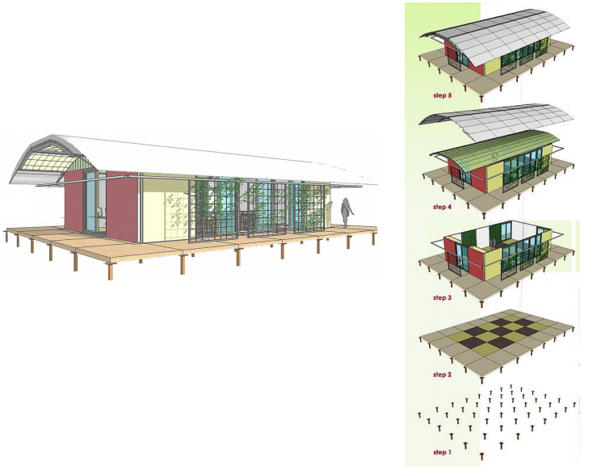
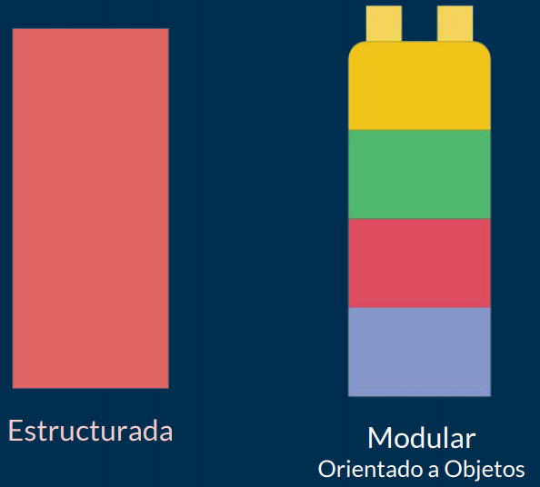

# Clase 10 *Modularidad*

La modularidad es un concepto que va muy relacionado con las clases y que también es uno de los principios de la Programación Orientada a Objetos, esto por supuesto va muy de la mano con el diseño modular.

**Diseño Modular**

El diseño modular viene de la arquitectura e incluso del diseño per se que significa subducir un sistema en partes más pequeñas llamadas módulos. Estos módulos pueden funcionar de manera independiente y podrán comunicarse con ellos (con todos o sólo con una parte) a través de unas entradas y salidas bien definidas.

Tenemos como ejemplo este sofá:

Este sofá fue divido y diseñado completamente módulos, cada asiento o lugar es un módulo que se pensó para robustecerla a medida que se van añadiendo más asientos.

Cada módulo (asiento) vive por sí mismo, y puede ser movido y unificado para crear un sistema entero.

***Modularidad***

***Es a capacidad que tiene un sistema de ser estudiado, visto o entendido como la unión de varias partes que interactúan entre sí y que trabajan para alcanzar un objetivo común, realizando cada una de ellas una tarea necesaria para la consecución de dicho objetivo. Cada una de esas partes en que se encuentre dividido el sistema recibe el nombre de módulo.***

***La modularidad es una opción importante para la escalabilidad y comprensión de programas, además de ahorrar trabajo y tiempo en el desarrollo.***

Otro ejemplo de modularidad está en el diseño de este edificio:

Se puede ver como las construcciones actuales son radicalmente más rápido ya que anteriormente se tomaba muchos años poder terminar un edificio, pero ahora gracias al sistema de la modularidad es muy fácil hacer la construcción en muy corto tiempo. Esto se debe a que se genera cada elemento por separado y esto permite que se creen edificaciones en masa.

**Programación Estructurada vs Programación Orientada a Objetos**

En la Programación Estructurada vimos código en un solo módulo, sabemos que la desventaja está en que los programas son muy grandes, con muchas líneas donde vamos encontrando errores, era difícil de leer y mantener, y si algo tronaba todo el programa caía destrozado.

En cambio nuestro lema, que debemos entender y aplicar en la Programación Orientada a Objetos, será ***divide y vencerás***. La modularidad nos va ayudar a tener los elementos separados de tal forma que puedan vivir independientemente y cumplan el principio de la edificación, es decir, podamos generar sistemas en masa.

Entonces, si algo sucede en uno de los módulos, el error solo afectara a ese módulo y por lo tanto toda el sistema no colapsará. Puedes decidir si quieres crear un programa en trozos de código y esto por supuesto tiene un grado de complejidad que a muchos le cuesta entender o analizar para llevarlo ahí. Pero, lo primero es quitarnos esa barrera de "No puedo" e intentarlo para empezar a trabajar ese fragmento de código.

La modularidad de nuestro código nos va a permitir:

- Reutilizar
- Evitar colapsos
- Hacer nuestro código más mantenible
- Legibilidad
- Resolución rápida de problemas

No olvidemos el programar en pequeños trozos. En vez de imaginarnos un código grande, lo importante es imaginar y empezar a pensar que debemos programar en pequeños trozos.

Esto precisamente es uno de los principios de una clase. La clase será precisamente lo que provoque la modularidad y nos va a permitir analizar nuestros problemas, modularizar para que nuestras clases que vivan por separados, separar el comportamiento del objeto de otro comportamiento. Tener una clase nos va permitir fomentar la modularidad, además de los otros beneficios.

Uno de las buenas prácticas es que las clases deberán vivir en archivos separados, esto por supuesto para mantener la modularidad, y evitar que un código este encima de otro o que un código viva en el mismo archivo. La forma en que vamos a generar la modularidad es separar las clases en archivos diferentes, de esta forma mantenemos aislado el código una vez que tengamos nuestro análisis.