# Clase 13 _Clases en UML y su sintaxis en código_

En esta clase veremos cómo podemos definir las clases para plasmarlas en un
diagrama UML. Recordemos que nuestro proceso es: identificar el problema,
identificar los objetos, definir las clases y finalmente plasmarlas en un
diagrama.

**Clases en UML**

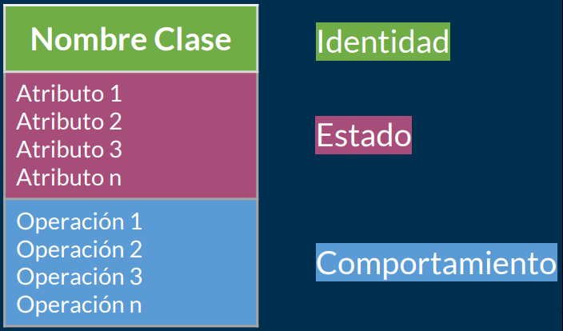

En UML, una clase será representada como un rectángulo con tres zonas:

- **Superior:** Es donde colocaremos el nombre de la clase
- **Intermedio:** Aquí definiremos los atributos
- **Inferior:** Es donde estarán los comportamientos, es decir, los que serán
  las funcionalidades.

Con esto le daremos a nuestras clases en UML una identidad (nombre de la clase),
estados (atributos o propiedades) y operaciones (comportamientos).

Para nuestro ejemplo, imaginemos que tenemos una clase **Person** cuyo atributo
o propiedad es **name** y su comportamiento sea **walk()**:

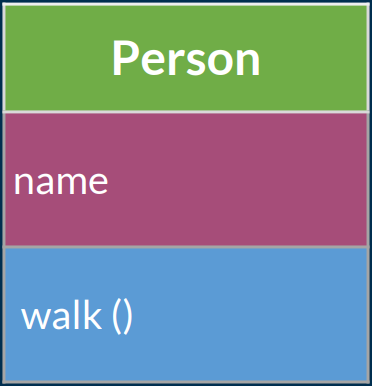

Ya, una vez identificado el objeto Person y puesto en un diagrama UML, nuestro
siguiente paso es definirlo en código.

**SINTAXIS EN CÓDIGO**

Nosotros ya habíamos dicho que trabajaremos en cuatro lenguajes: Java, Python,
JavaScript y PHP.

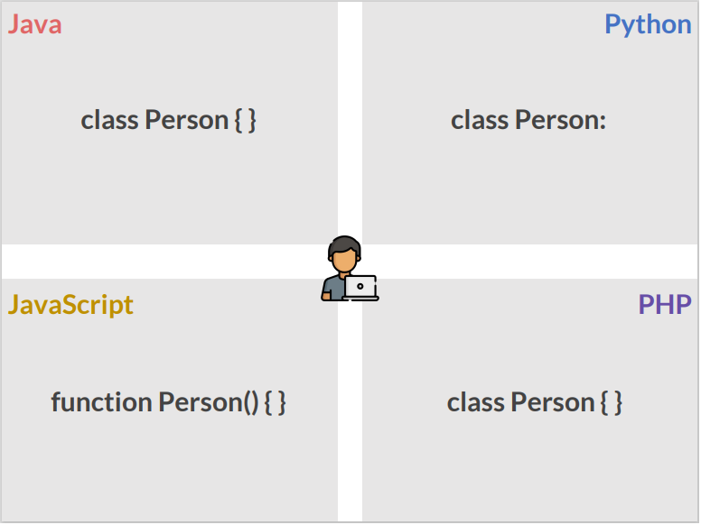

- **Java:** Para declarar una clase utilizamos la palabra reservada **class**,
  seguido del nombre de la clase y finalizamos con llaves.

  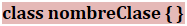

- **Python:** Aquí usamos la palabra reservada **class**, seguido del nombre de
  la clase y finalizamos con dos puntos.

  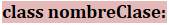

- **JavaScript:** Como sabemos este lenguaje se maneja de forma distinta y eso
  se debe a que todo es a través de prototipos. Sin embargo, utiliza la
  Programación Orientada a Objetos para analizar problemas y posteriormente
  poder plasmarlos en código de la mejor forma, por lo tanto al tenerlo en
  prototipos utilizaremos "funciones especiales" para definir las clases.
  Usaremos la palabra reservada **function** seguido del nombre de la clase con
  paréntesis y finalizaremos con llaves.

  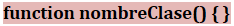

- **PHP:** Para declarar una clase nueva es totalmente idéntico a como
  declaramos en Java.

**DEFINIR ATRIBUTO Y COMPORTAMIENTO**

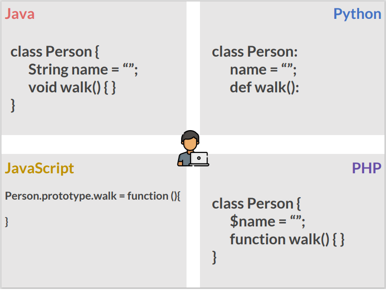

- **Java:** Para declarar un atributo es necesario poner el tipo de dato seguido
  del nombre, y para declarar un método ponemos el tipo seguido del nombre con
  dos paréntesis y finalizamos con llaves.
- 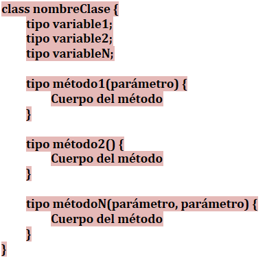

- **Python:** Este lenguaje no es estricto en su tipado, por lo que para definir
  variables es simplemente necesario poner el nombre, en nuestro ejemplo ponemos
  comillas dobles para que Python infiera que es un string, y para declarar un
  método utilizamos la palabra reservada def. La forma que usa Python para
  agrupar declaraciones es mediante indentaciones, por lo que en el intérprete
  interactivo debes teclear un tabulador o espacio(s) para cada línea indentada.

  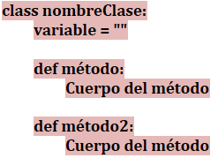

- **JavaScript:** Cuando se empieza a programar en un lenguaje como JavaScript,
  es decir, permisivo hasta no poder más, dar los primeros pasos puede resultar
  realmente complicado. Para declarar nuestras propiedades se utiliza la palabra
  reservada this y los métodos son declarados afuera usando la palabra reservada
  prototype seguido de la función.

  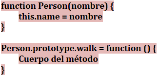

- **PHP:** Siendo también un lenguaje bastante flexible así que para declarar
  una variable usamos el símbolo $, sin importar el tipo de dato, y para
  declarar un método es lo mismo que una función.

  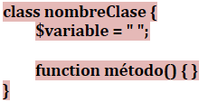
