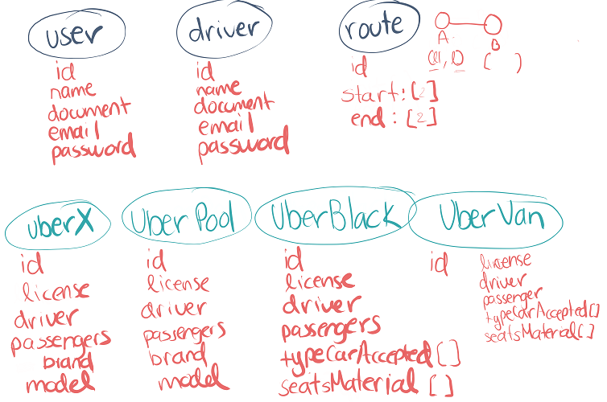
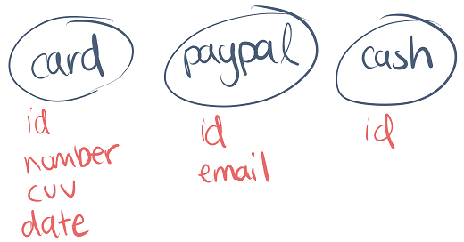

# Clase 14 *Modelando nuestros objetos Uber*

Acabamos de aprender como plasmar objetos en diagramas de clase en UML, hagamos esto mismo en nuestro proyecto Uber. Analicemos los objetos y quitemos todos sus atributos.

- **User**
  
  - **Id:** El identificador. Es bastante útil cuando manejamos una base de datos.
  - **Name**
  - **Document:** Es el documento que dependiendo del país puede ser numérico o alfanumérico. En este caso puede ser la CI, la CURP o el RFC.
  - **Email**
  - **Password**

- **Driver**
  
  - **Id**
  - **Name**
  - **Document**
  - **Email**
  - **Password**

- **Route:** Como sabemos que se compone de un punto A y un punto B, sabemos que las ubicaciones tienen una latitud y una longitud.
	
	- **Id**
	- **Start [2]:** Representa el punto A y será un arreglo que contenga tanto la latitud como la longitud.
	- **End [2]:** Representa el punto B y será un arreglo que contenga tanto la latitud como la longitud.

- **UberX**
  
	- **Id**
	- **License:** Será la placa del vehículo
	- **Driver:** El conductor designado del vehículo
	- **Passengers:** La cantidad de pasajeros
	- **Brand:** Marca del vehículo
	- **Model:** Modelo de vehículo

- **UberPool**
  
	- **Id**
	- **License**
	- **Driver**
	- **Passengers**
	- **Brand**
	- **Model**

- **UberBlack**
	
	- **Id**
	- **License**
	- **Driver**
	- **Passengers**
	- **typeCarAccepted [ ]:** Existe un catálogo de vehículos únicamente aceptados por Uber y se componen de la marca, modelo y año.
	- **seatsMaterial [ ]:** Los Uber Black necesitan tener interior con materiales de piel o vinilo.

- **UberVan**
	
	- **Id**
	- **License**
	- **Driver**
	- **Passengers**
	- **typeCarAccepted [ ]**
	- **seatsMaterial [ ]**

Si quieres saber más de los requerimientos de autos puedes ingresar en [Requisitos de autos](https://www.uber.com/mx/es/drive/mexico-city/vehicle-requirements/ "Requisitos de autos").

Ahora analizaremos los últimos objetos que nos quedan:

- **Card**
	
	- **Id**
	- **Number:** Es el número de la tarjeta.
	- **CVV:** El número escondido por detrás.
	- **Date:** Es la fecha de vencimiento.

- **PayPal**
	
	- **Id**
	- **Email:** El correo asociado a la cuenta.

- **Cash**
  
	- **Id**
	- Cash no necesitara nada más que el identificador del tipo de pago ya que en este caso no tenemos registro de este tipo.

Con esto ya tenemos analizado todos nuestros objetos, pero hay algo de redundancia en el diagrama. En la siguiente clase veremos cómo podemos solucionarlo con la herencia.