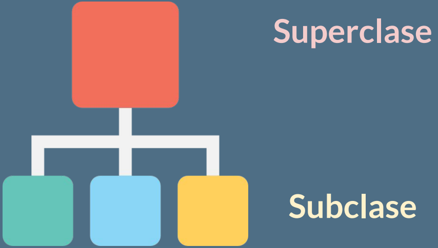
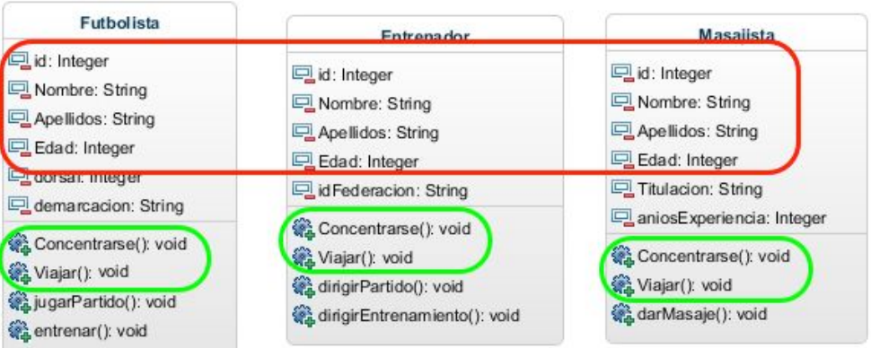
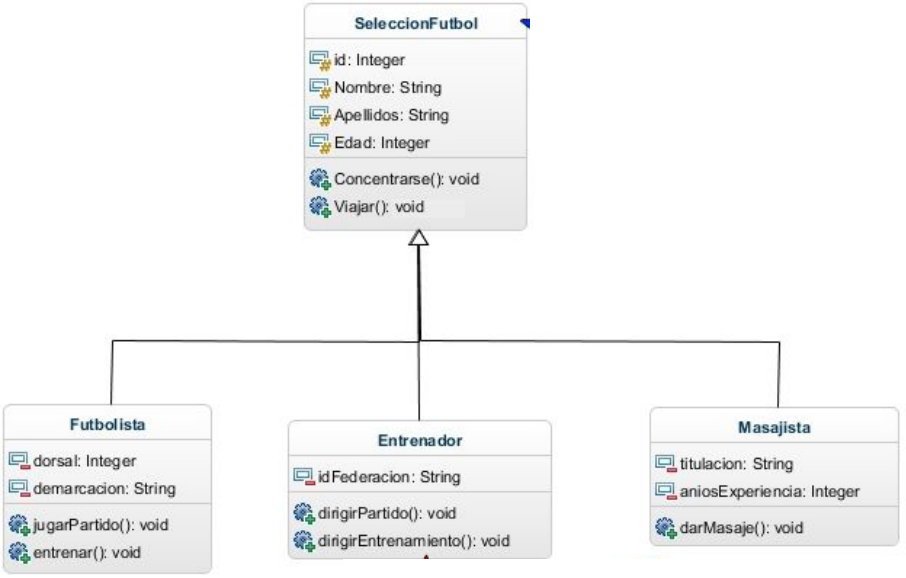

# Clase 15 *¿Qué es la herencia?*

En la clase anterior notamos que nuestro ejemplo tenía atributos repetidos y no solo fue uno, sino que fueron varios. Muchas clases entre sí tenían atributos que estaban siendo redundantes entre ellas, pues esto estaba violando una de las leyes del código.

«**Don't repeat yourself**» es una filosofía que promueve la reducción de la duplicación en la programación. Siempre nos inculcara que no tengamos líneas de códigos duplicadas y, en este caso, todavía no hemos hecho código estamos a un paso de hacerlo, pero si lo llevamos así como esta estaríamos violando esta filosofía. Por lo tanto, toda pieza de información no debería ser duplicada debido a que la duplicación incrementa la dificultad en los cambios y su evolución.

Si nosotros dejamos esto así como esta, se nos va a dificultar que en el futuro podamos ejecutar cambios e incluso involucrar un objeto o un elemento más en el proyecto, hará que el código sea más difícil de leer y entender, y hace un mantenimiento se nos va a complicar bastante. Por lo tanto no debemos tener líneas duplicadas en la medida posible.

**¿Qué debemos hacer?**

Haremos uso de uno de los principios de la programación orientada a objetos, la reutilización de código. La herencia es una de las piezas claves a la hora de reutilizar líneas de código a más no poder.

**Herencia**

La herencia es un pilar importante dentro de la programación orientada a objetos y nos permitirá crear nuevas clases a partir de otras.

Podemos definir la herencia como la capacidad de crear clases que adquieren de manera automática los miembros (atributos y métodos) de otras clases que ya existen, pudiendo al mismo tiempo añadir atributos y métodos propios.

Lo que haremos es que, una vez detectemos elementos duplicados, ejecutaremos una abstracción de tal manera que podamos generar una clase que sea la más general y, entonces, esa clase general nos permitirá crear nuevas clases. Tendremos una jerarquía, una estructura de padre e hijo, y es que un padre puede tener tantos hijos como sea necesario. Es común encontrar que un padre solo tenga un único hijo, pero, como en nuestro ejemplo, un padre puede tener bastantes hijos a través de la abstracción.

- **Clase Padre:** También llamada Super Clase, será la clase cuyas características se heredan.
- **Clase Hijas:** Llamada también Sub Clase. Son las clases que heredan de Clase Padre, puede agregar sus propios campos y métodos, además de los campos y métodos de la superclase.

**EJEMPLO**

Para ejercitarnos y poder identificar herencias tenemos el siguiente ejemplo:

En donde tenemos tres clases (Futbolista, Entrenador y Masajista), si analizamos estas clases podemos ver que comparten cuatro atributos y además tienen en común dos métodos.

En programación orientada a objetos, cuando detectamos que hay elementos repetidos, esto nos indica que debemos hacer algo. Algo no está bien y que seguramente, si lo dejamos así, nos traerá problemas a futuro. Una vez detectada una relación de estos elementos, podemos generar una abstracción de eso y entonces crear una clase que tengan todos estos elementos en común.

En este caso creamos **SeleccionFutbol** que será la superclase y de ella se estarán heredando: **Futbolista**, **Entrenador** y **Masajista**. Cuando ellos heredan, esto significa que automáticamente todos los atributos y métodos que tenemos ahí serán heredados a las subclases y no tenemos que estarlo escribiendo en código, simplemente aplicando la herencia automáticamente van aparecer en cada clase.

Esta es una forma de analizar herencia, hay otra forma y es partiendo de los elementos en común. En general podemos tener elementos que no tengan ningún atributo en común, pero la lógica del negocio nos va a decir que esto debe considerarse como una clase más general, deben agruparse en una clase más general aunque y esa se puede llamar una clase padre.