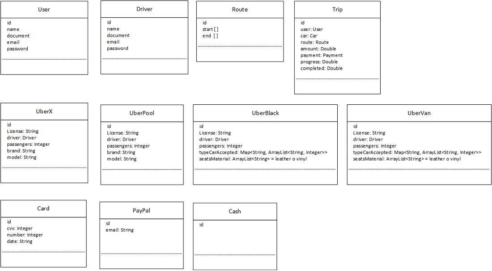
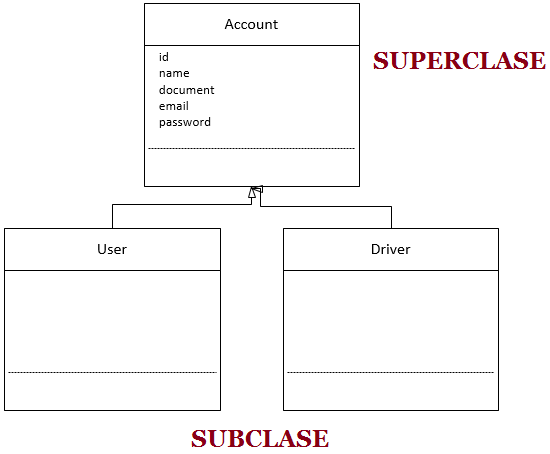
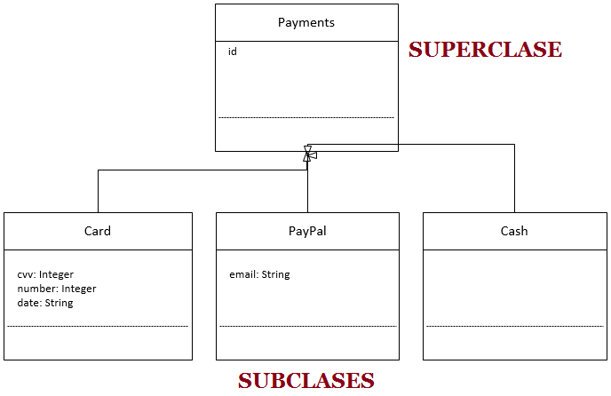
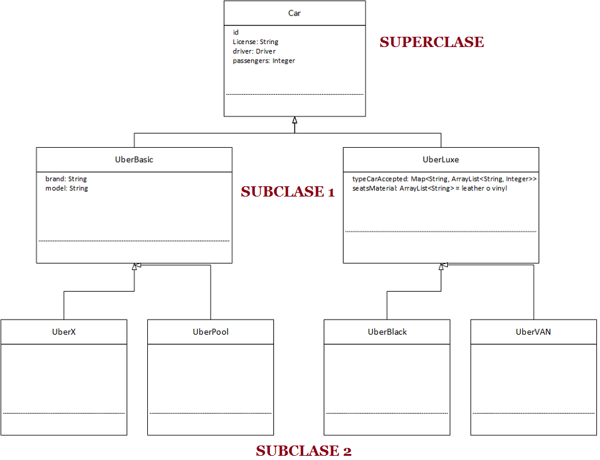

# Clase 16 _Aplicando Herencia a nuestro proyecto Uber_

Aplicaremos lo aprendido en la clase anterior y eso es detectar todos los
atributos que son redundantes en nuestro proyecto Uber.

Tenemos plasmado nuestro proyecto en forma de diagrama de clase:

Y ahora vamos a detectar la redundancia entre estos elementos para aplicar la
herencia.

**USER – DRIVE**

Comencemos por las clases User y Drive que tienen todos sus atributos en común.
Si sacamos esos elementos comunes podemos crear la clase Account, que poseerá la
jerarquía principal y se convertirá en la Super Clase o Clase Padre, mientras
que User y Driver se heredaran de Account convirtiéndose en Sub Clases o Clases
Hijas.

Para ejemplificar la herencia usamos flechas vacías que apuntan hacia la Clase
Padre.

**CARD – PAYPAL – CASH**

En el caso de las clases Card, PayPal y Cash no tenemos ningún elemento en
común, sin embargo, todos son del mismo tipo así aplicaremos la otra forma de
herencia: según la lógica de negocios.

**UBERX – UBERPOOL – UBERBLACK – UBERVAN**

En el caso de los automóviles, las cuatros clases Uber tienen cuatro atributos
en común que formaran parte de la Super Clase, sin embargo, todavía existen
elementos comunes entre UberX y UberPool, y UberBlack y UberVan así que podemos
hacer uso nuevamente de la herencia para otra Sub Clase.

**Modelo Simplificado**

Así es como estaría quedando nuestro sistema Uber.

