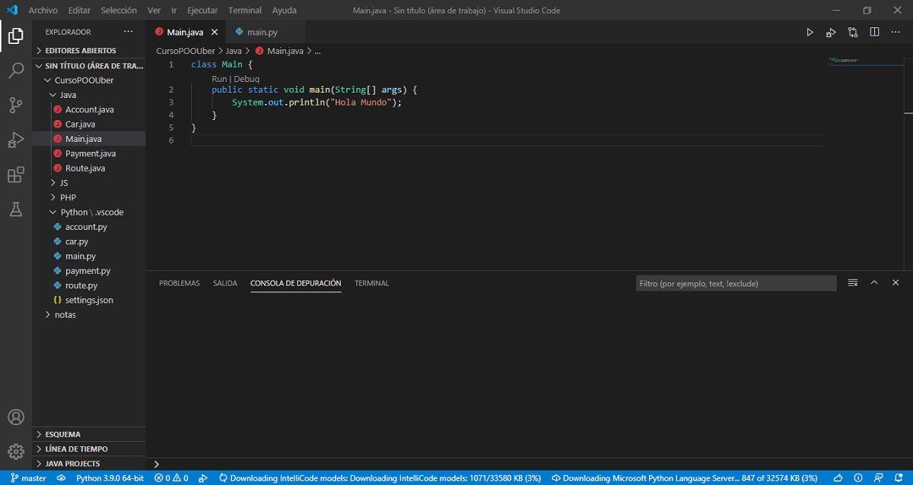
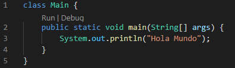
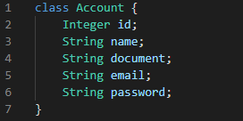
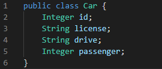
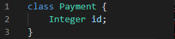
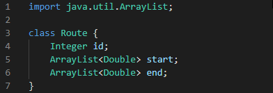
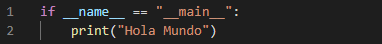
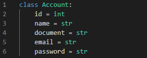
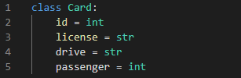
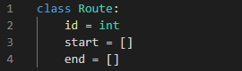

# Clase 18 _Definiendo clases en Java y Python_

Ahora que está listo nuestro modelo podemos comenzar con la etapa de
programación de nuestro proyecto. Como vimos, todo el módulo anterior se basó en
el análisis de los objetos; analizar y obtener los objetos, abstraerlos para
convertirlos en clases y finalmente ejecutar un análisis de herencia para tener
una mejor versión de nuestros objetos.

**Visual Studio Code**

Primeramente estaremos creando cuatro carpetas llamadas Java, Python, JavaScript
y PHP en donde iremos depositando los documentos para sus correspondientes
lenguajes.

Siguiendo nuestro diagrama de herencia que hicimos del proyecto estaremos
creando cuatro archivos para las clases principales: Account, Car, Payment y
Router. Además de un archivo **Main** que será donde generaremos el punto de
entrada al programa, todo lo que queremos que funcione y sea visto debemos
declararlo en este documento.

**JAVA**

- **Main:** Lo que debes saber en primer lugar es que el método main() es el
  punto de entrada de la aplicación, es decir, es el punto en el que comienza la
  ejecución de esta. Es por ello que ha de ser public (accesible desde fuera de
  la clase) y static (se puede ejecutar sin una instancia de la clase).

  

- **Account:** Es la super clase de la que se derivaran las clases Drive y User.

  

  - Para declarar variables en Java ponemos primero el tipo de dato que estará
    manejando nuestro usuario y posteriormente el nombre.

- **Car:** Es la super clase de la que se derivaran las clases UberX, UberPool,
  UberBlack y UberVan.

  

  - Momentáneamente estaremos declarando 'drive' de tipo string, aunque sabemos
    que es del tipo Drive.

- **Payment:** Es la super clase de la que se derivaran las clases Card, PayPal
  y Cash.

  

- **Router:** Es la clase que contendrá las ubicaciones de nuestros puntos A y
  B.

  

  - Una opción muy conveniente cuando usamos una clase o interfaz de otro
    paquete, es el uso de la palabra clave import. Si usamos **import**, no es
    necesario escribir el nombre completo de la clase con el paquete incluido.
    Es suficiente con el nombre de la clase.
  - En este caso, nosotros usaremos **ArrayList** que pertenece a la biblioteca
    java.util. Por tanto, para emplearla en nuestras clases o programas
    escribiremos como código en cabecera _**import java.util.ArrayList**_ (o de
    forma más genérica import java.util.*).
  - **ArrayList:** Es una clase que permite almacenar datos en memoria de forma
    similar a los Arrays, con la ventaja de que el número de elementos que
    almacena, lo hace de forma dinámica, es decir, que no es necesario declarar
    su tamaño como pasa con los Arrays.

**PYTHON**

- **Main:** Este main, básicamente, comprueba si un módulo *.py se está
  importando a nuestro código y establece, de ser así (y de ahí el condicional
  if) que sea el módulo actual el principal, el que asume el papel de main(),
  aquél que deberá ejecutarse primero, mientras que el módulo importado se
  ejecutará a continuación.

  

- **Account:** Como podemos ver, somos capaces de declarar el tipo de dato que
  queremos que sean de esta forma.

  

  - Para declarar variables en Python, en cambio, va primero el nombre y después
    podemos asignarle el tipo de datos.

- **Card**

  

- **Payment**

  

- **Router**

  

  - Las variables de tipo arrays en Python se declaran poniendo corchetes
    vacíos.
