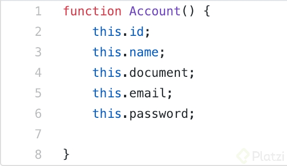
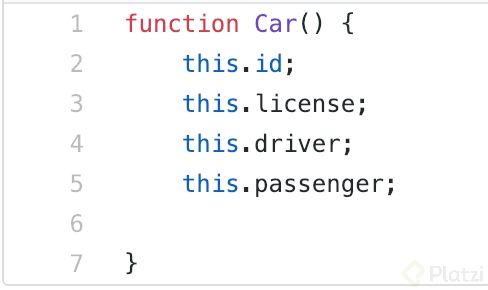
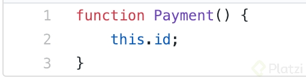
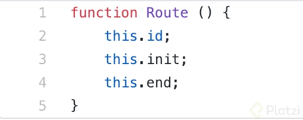

# Clase 19 _Definiendo Clases en JavaScript_

Si estás interesado en aprender JavaScript desde ahora debes saber que el
concepto de clases no existía como tal hasta el nuevo estándar ECMAScript 6. El
reto de encontrar sistemas construidos con este estándar es alto por esa razón
te explicaré cuál fue por mucho tiempo su equivalente.

Los Prototipos fue la forma de crear clases en JavaScript y las representaremos
partiendo de la declaración de una función.

Creemos nuestras clases:

- Account
- Car
- Payment
- Route

Para esto crearemos el siguiente sistema de archivos dentro de la carpeta JS de
nuestro proyecto:

- Account.js
- Car.js
- Payment.js
- Route.js
- index.js

El archivo index.js será el lugar equivalente al punto de entrada de la
aplicación donde estaremos declarando nuestros objetos basado en las clases.
Para esta clase lo dejaremos en blanco.

Ahora veamos el código archivo por archivo:

**Account.js**

**Car.js**

**Payment.js**

**Route.js**

[Aquí](https://github.com/anncode1/Curso-POO-Platzi/tree/f5725787165b36cae579f94e428068039b554b0b/JS "Aquí")
podemos ver el código del proyecto.

En este código notarás el uso de la palabra reservada this. Normalmente cuando
usamos la sintaxis punto siempre lo haremos a partir de un objeto instanciado,
en este caso con this, se hace una simulación al objeto en cuestión, a pesar de
que en ese momento visualmente sigue siendo una clase.

Digamos que se adelanta un poco al momento de ejecución y visualiza al objeto
con sus atributos, más adelante verás la forma en que podemos asignar datos a un
atributo del objeto en otros lenguajes y verás que es exactamente la misma
sintaxis.

Si intentáramos poner this en el momento de ejecución nos traería un listado de
todos los componentes de la clase que en este caso son solo estos tres: id, init
y end.

This hace referencia al objeto instanciado. Para comprender del todo esta última
frase mira la siguiente clase donde hablamos de objetos.

**Reto**

- En la carpeta de nuestro proyecto PHP declara estas mismas clases: Puedes
  utilizar esta
  [clase](https://platzi.com/clases/1338-php/12929-programacion-orientada-a-objetos1172/ "clase")
  de apoyo.
- Inténtalo y compártenos tus resultados, compáralos con tus compañeros.
