# Clase 20 *Objetos, método constructor y su sintaxis en código*

Los objetos nos ayudan a crear instancia de una clase, el objeto es el resultado de lo que modelamos, de los parámetros declarados y usaremos los objetos para que nuestras clases cobren vida.

Los métodos constructores dan un estado inicial al objeto y podemos añadirle algunos datos al objeto mediante estos métodos. Los atributos o elementos que pasemos a través del constructor serán los datos mínimos que necesita el objeto para que pueda vivir.

Lo anteriormente hecho solo fueron clases, no pudimos nada en pantalla más que unos mensajes que decían "hola mundo", pero sin poder hacer verdaderamente nada. Para poder utilizar los elementos declarados dentro de esas clases empezaremos a trabajar con los objetos.

Recordemos que los objetos nos ayudaran a crear instancias de una clase, es decir, es el resultado de lo que moldeamos, de los parámetros declarados y usaremos los objetos para que nuestras clases cobren vida.

**Declarar objetos**

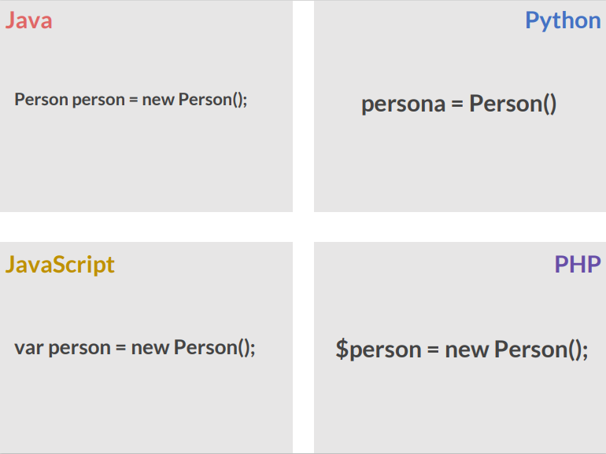

- **Java:** Al momento de crear objetos en Java, debemos tener claras dos cosas indispensables, la primera es el nombre de la clase para la cual vamos a crear el objeto y segundo el constructor que dicha clase posee, es decir, si el constructor recibe o no parámetros. Para crear objetos en Java, el lenguaje nos proporciona el comando new, con este comando le decimos a Java que vamos a crear un nuevo objeto de una clase en específico y le enviamos los parámetros (en caso de ser necesario) según el constructor.
	
	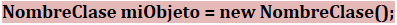
		
- **Python:** Haciendo valer su fama como un lenguaje flexible, para declarar un objeto es bastante sencillo ya que solo necesita el nombre del objeto y la clase a la que hara instancia.
	
	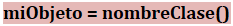
		
- **JavaScript:** Al igual que con muchas cosas en JavaScript, la creación de un objeto a menudo comienza con la definición e iniciación de una variable. También hacemos uso del comando new para crear un nuevo objeto de una clase específica.
	
	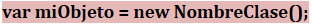
		
- **PHP:** Para crear una instancia de una clase, se debe emplear la palabra reservada new. Un objeto se creará siempre a menos que el objeto tenga un constructor que arroje una excepción en caso de error. Las clases deberían ser definidas antes de la instanciación (y en algunos casos esto es un requerimiento).
		
	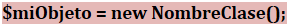

**Método constructor**

Un constructor es un método especial de una clase que se llama automáticamente siempre que se declara un objeto de esa clase. Su función es inicializar el objeto y sirve para asegurarnos que los objetos siempre contengan valores válidos.

Para nosotros, las paréntesis representaran los métodos.

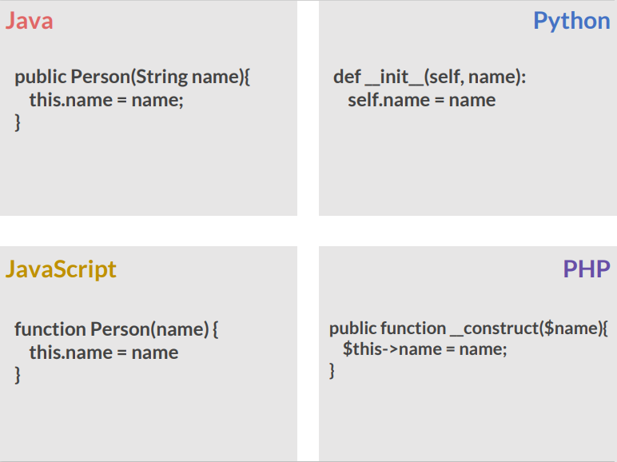

- **Java:** En el lenguaje Java, si para una clase no se define ningún método constructor se crea uno automáticamente por defecto. El constructor por defecto es un constructor sin parámetros que no hace nada. Los atributos del objeto son iniciados con los valores predeterminados por el sistema.
	
	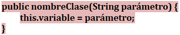
	
- **Python:** En Python, el método constructor siempre se llama __init__ (dos subrayados antes y después de init).
	
	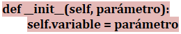
			
- **JavaScript:** En JavaScript, la función sirve como el constructor del objeto, por lo tanto, no hay necesidad de definir explícitamente un método constructor. Cada acción declarada en la clase es ejecutada en el momento de la creación de la instancia.
	
	

- **PHP:** Debemos definir un método llamado __construct (es decir utilizamos dos caracteres de subrayado y la palabra construct). El constructor debe ser un método público (public function).
	
	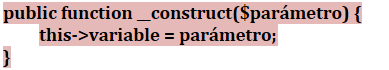
	
***NOTA: No te preocupes por entender esto, no te compliques, lo estaremos viendo más adelante.***

**Pasar datos por parámetros**

Dependiendo del tipo de dato que enviemos a la función, podemos diferenciar dos comportamientos: Paso por valor (se crea una copia local de la variable dentro de la función) y Paso por referencia (se maneja directamente la variable, los cambios realizados dentro de la función le afectarán también fuera).

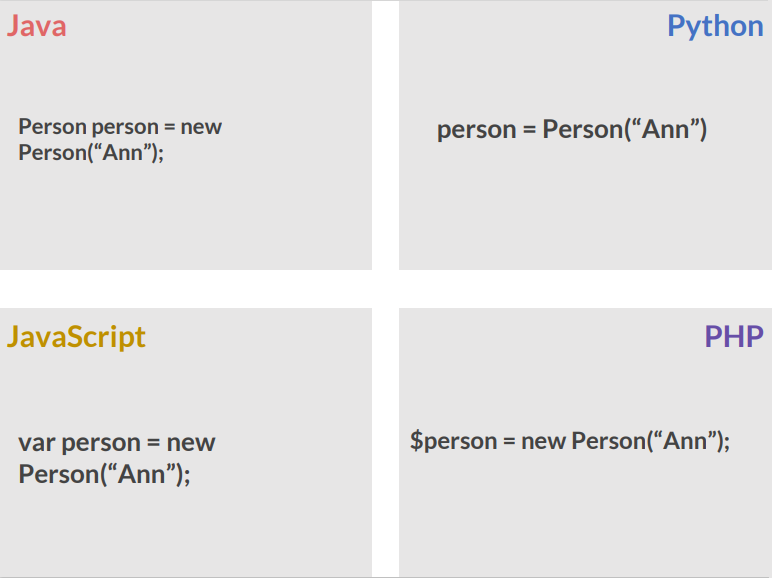

- Java
	
	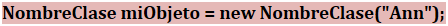
		
- Python
	
	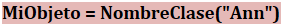
		
- JavaScript
	
	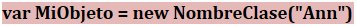
		
- PHP
	
	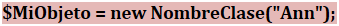

Como es visible en todos los casos, para enviar un valor es únicamente necesario ponerlos dentro de los paréntesis. Como en este caso estamos enviando un cadena de caracteres o string, ponemos comillas dobles, algo que no es necesario cuando enviamos como valor un número.