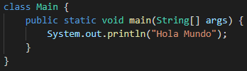
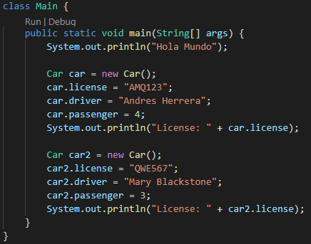
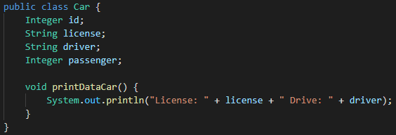
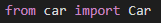
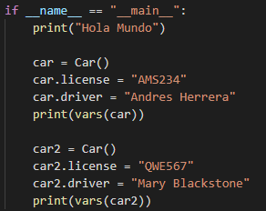

# Clase 21 _Objetos. Dando vida a nuestras clases en Java y Python_

Ya aprendimos la forma de crear objetos y sabemos la sintaxis básica en los
cuatros lenguajes que vamos estudiando, ya es hora de ver como declarar esos
objetos en Java y Python.

Recordemos que anteriormente dejamos nuestras clases listas. Por el momento, y
por el bien de la práctica, usaremos la clase Car ya que es la que más sentido
se nos hace.

**JAVA**

Primeramente, para crear objetos en el lenguaje Java, debemos ir a nuestra clase
Main que recordemos tiene actualmente esto:

Debemos recordar que para crear un objeto se sigue esta sintaxis: el tipo de la
clase, nombre del objeto, igualamos (=), usamos la palabra reservada new y
terminamos con el método constructor que trae por defecto las clases de Java.

En nuestro caso quedaría así:

- **Car:** Sería la clase que estaríamos usando.
- **car, car2:** Son el nombre de los objetos.
- **new:** Palabra reservada para la creación de objetos.
- **Car():** Es como llamamos al método constructor.
- **Operador punto (.):** Nos permite acceder a los distintos atributos de la
  clase. Cuando tenemos un objeto de un tipo determinado y queremos acceder a
  uno de sus atributos solo tenemos que poner el identificar asociado al objeto
  seguido por un punto y por el identificador que hace referencia a un miembro
  concreto de la clase a la que pertenece el objeto.

  - **car.lincense():** Accedemos al atributo license en el que guardamos la
    licencia que tiene el vehículo.
  - **car.driver ():** Accedemos al atributo driver en el que guardamos el valor
    del nombre que tiene nuestro conductor.
  - **car.passenger():** Accedemos al atributo passenger en el que guardamos la
    cantidad de pasajeros que podrá llevar ese vehículo.

- **System.out.println():** En Java hay algunos objetos que existen por defecto
  (en cualquier entorno de desarrollo). Uno de ellos es el objeto denominado
  System.out. Este objeto dispone de un método llamado println que nos permite
  imprimir algo por pantalla en una ventana de consola.

Para no tener que estar declarando System.out.println() cada vez que deseamos
imprimir el valor de nuestro objeto, podemos crear un método en la clase Car:

- Debajo de los atributos escribimos el método: primero el tipo y después el
  nombre, como no recibirá nada no necesita parámetros.
- La palabra void indica que el método printDataCar no retorna ningún valor,
  solamente imprimirá en pantalla la licencia y el conductor.

Finalmente, en nuestra clase Main cambiamos los System.out.println() por
_**car.printDataCar()**_ y _**car2.printDataCar().**_

De esta forma, con los objetos, estamos accediendo a los atributos y a los
objetos. Reutilizamos código para imprimir datos de los objetos.

**PYTHON**

Para crear objetos dentro de Python es necesario importar la clase de la que
estaremos usando los elementos eso se hace escribiendo al principio de toda la
clase Main:

- Donde car es el nombre del archivo y Car es el nombre de la clase.

Como en Python no es necesario escribir el tipo de clase y tampoco la palabra
reservada new, simplemente creamos los objetos directo:

En general permanece bastante similar al Java, excepto por algunos cambios
obvios:

- **car, car2:** Son el nombre de los objetos.
- **Car():** Es como llamamos al método constructor.
- **Operador punto:** Nos permite acceder a los distintos atributos de la clase.

El cambio está en la forma de imprimir un objeto, no necesitamos crear un método
especial para poder hacerlo, sino que simplemente usamos vars dentro de un print
y le pasamos el objeto como parámetro:

- **print:** Es lo que nos permite mostrar texto en pantalla.
- **vars:** Toma como máximo un parámetro y devuelve los atributos del objeto.
  En este caso lo imprime en formato JSON, pero si queremos otro formato ya
  podemos ponerle un método. Sin embargo, en este caso, para fines
  demostrativos, nos funciona super bien.
