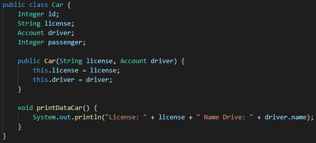
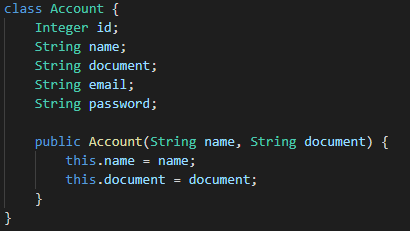
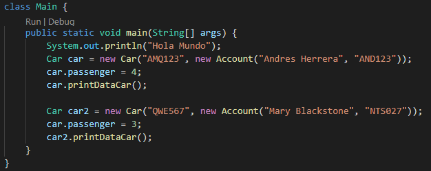
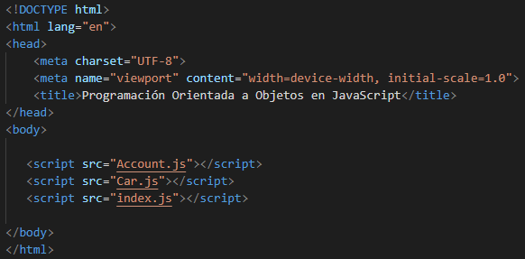
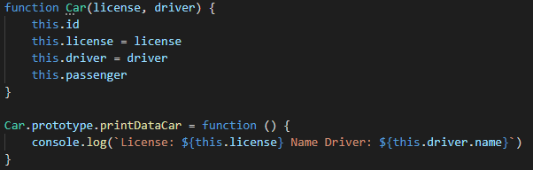
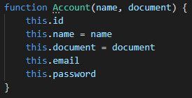
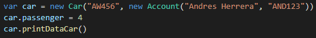

# Clase 22 _Declarando un Método Constructor en Java y JavaScript_

En la clase anterior vimos como declarar el método constructor en el caso de
Java y Python, hoy vamos a ponerlo en acción para el caso particular de
JavaScript y Java.

**JAVA**

Primeramente lo veremos en el caso de Java para entenderlo mejor, porque en
JavaScript es bastante peculiar.

Lo que haremos es ir a la clase Car en donde crearemos nuestro método
constructor:

- **public:** Indica que es un método accesible a través de una instancia del
  objeto.
- **Car():** Es el nombre que tendrá nuestro método.
  - Dentro de las paréntesis van los parámetros obligatorios para crear un
    objeto de tipo Car. En este caso, lo mínimo necesario es license y drive.
- Dentro del constructor ponemos this., y esto no es más que una buena práctica
  porque se acostumbra mucho que los parámetros tengan el mismo nombre que las
  propiedades.

  - **this.license:** Hace referencia al license, la variable global de la
    clase.
  - **license:** Hace referencia al parámetro license, la variable local que
    existen únicamente dentro del método.

- Ahora en nuestro método printDataCar si lo dejamos tal cual no imprimirá lo
  que estamos queriendo, por eso debemos cambiarlo y poner **driver.name**.

Hasta ahora también hemos estado manejando driver como un string, pero sabemos
que en realidad es de tipo Account, así que debemos ir a la clase Account para
crear su método constructor:

Ya hecho una vez todo esto y ejecutamos nuestro programa nos indicara un error,
porque no hemos realizado los demás cambios. Cuando sobrescribimos el método
automáticamente el método vacío que teníamos se pierde, así que para pasar los
datos debemos hacerlo dentro de las paréntesis:

- Como podemos ver, siendo nuestro driver del tipo Account debemos declararlo
  para que se cree un objeto.

Con esto tenemos los datos mínimos necesarios para que un vehículo exista dentro
de nuestra aplicación Uber.

**JAVASCRIPT**

Primero debemos crear un archivo HTML llamado index que funcionara como nuestro
Main, esto es porque JavaScript necesita un navegador que nos permita visualizar
todo.

En nuestro archivo index.html tendremos lo siguiente:

Es un esqueleto básico del HTML, lo importante está dentro del body donde
tenemos tres scripts que nos permitirá incluir o llamar nuestro código de tipo
JavaScript. Es importante ponerlos en ese orden porque de lo contrario no nos
funcionara, esto es porque JavaScript empieza a compilar y renderizar desde el
principio a medida que va leyendo línea por línea.

Ahora vamos a nuestra clase Car:

- Como podemos ver, no es necesitamos colocar el tipo de dato que tendrán los
  parámetros. Además los atributos que creamos ya son tomados como parte del
  método constructor y simplemente debemos igualar.
- Es en la creación del método **printDataCar** donde esta lo interesante.
  Sabemos que JavaScript toma los métodos como funciones especiales y son
  declarados fuera.
- Para imprimir nuestro resultado usamos el comando **console.log** que imprime
  en la consola.
- Una forma de concatenar string es la interpolación de cadenas y utilizan las
  comillas invertidas o backticks para delimitar sus contenidos. Las partes
  variables se denominan placeholders y utilizan la sintaxis ${ } para
  diferenciarse del resto de la cadena.

Ahora vamos a nuestra clase Account para pasar el nombre y el documento:

¿Recuerdas a index.js? Hasta el momento ha permanecido vacío, pero lo usaremos
para poner ahí todas las llamadas de nuestra clases y posteriormente mostrarlas.
Entonces, vamos a index.js:

- Declaramos un objeto **car** al que pasaremos los datos de la matrícula y del
  conductor.
- Incluso podemos usar el operador punto para acceder a la cantidad de pasajeros
  y usar nuestro método printDataCar.

Finalmente, para ver nuestros resultados, debemos abrir nuestro archivo HTML en
un navegador. En el navegador damos click derecho, inspeccionar y vamos a
consola, y ahí esta imprimido en pantalla nuestra clase de hoy.
