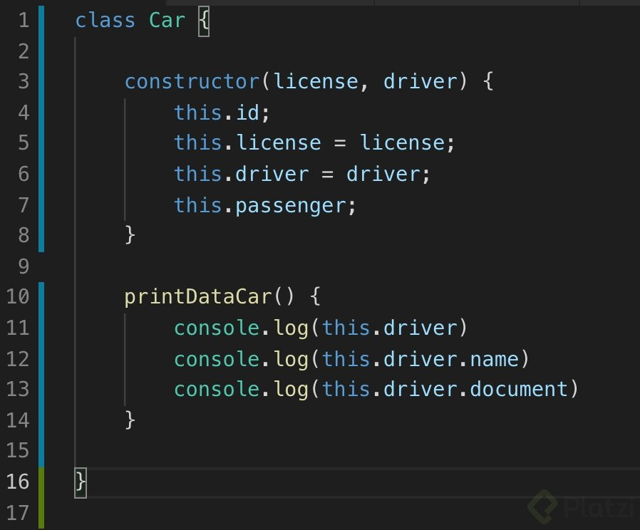
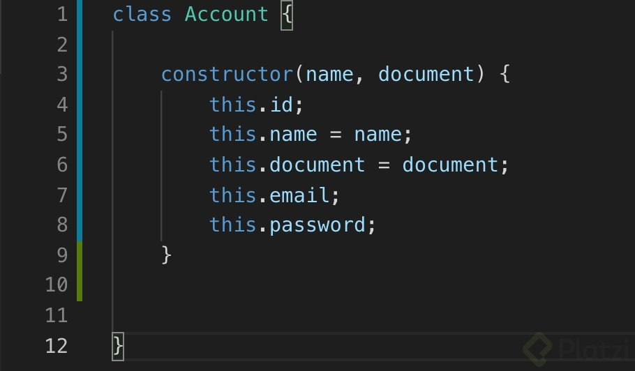
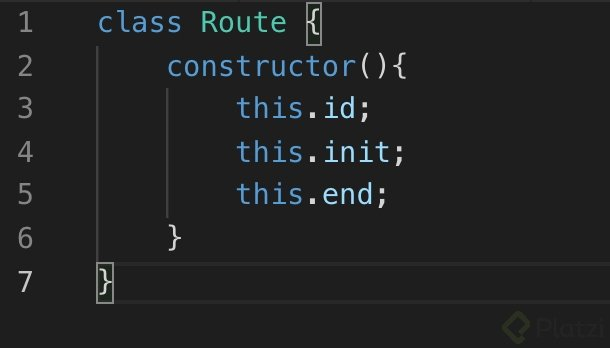
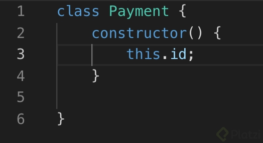
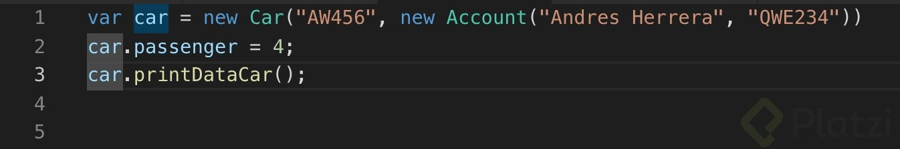
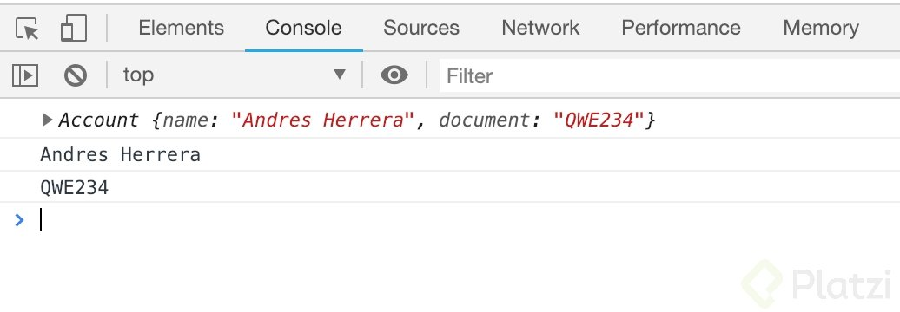

# Clase 23 *JavaScript orientado a objetos, lo más nuevo*

A partir de las nuevas especificaciones del ECMAScript 6 ya podemos declarar una clase con la palabra reservada class, aunque es importante aclarar que estos no dejan de ser prototipos, sino todo lo contrario.

Además tendremos una palabra clave para definir un constructor, y dentro de este estarán las propiedades de nuestra clase definidas listas para inicializarse.

Transcribamos el código JavaScript que generamos en la clase anterior a este nuevo estándar.

La clase Car quedaría así:

Si quisiéramos declarar un método, en esta nueva sintaxis dejaremos de utilizar la palabra clave function.

Ahora veamos a la clase Account:

Y para finalizar aquí puedes ver las clases Route y Payment:

Notarás que para instanciar un objeto seguiremos usando la palabra clave new.

Y los resultados serán los mismos:

