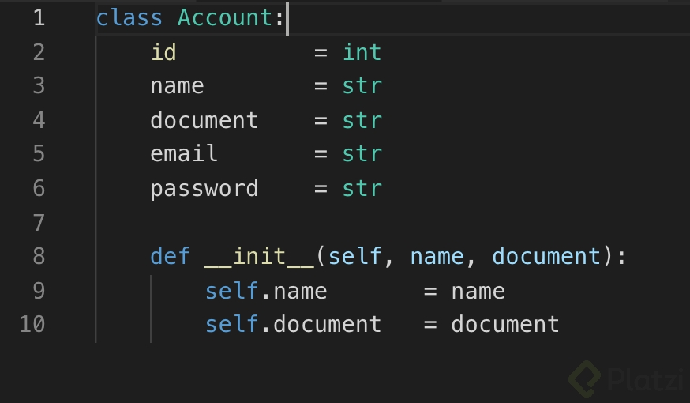
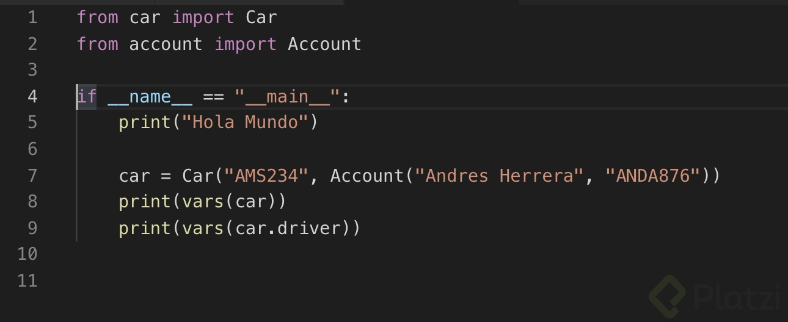
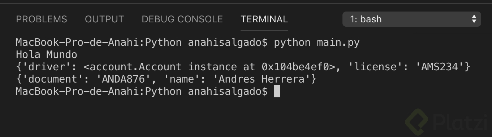

# Clase 24 _Declarando un Método Constructor en Python_

En Python encontrarás un concepto denominado Métodos Mágicos, estos métodos son
llamados automáticamente y estrictamente bajo ciertas reglas. El método
constructor en Python forma parte de esta familia de métodos y como aprendimos
en la clase anterior lo declaramos usando **init**, aunque si nos ponemos
estrictos este método no construye el objeto en sí. El encargado de hacer esto
es **new** y el método **init** se encargará de personalizar la instanciación de
la clase, esto significa que lo que esté dentro de **init** será lo primero que
se ejecute cuando se cree un objeto de esta clase.

Para nuestro proyecto tenemos la necesidad de que algunas variables se
inicialicen obligatoriamente cuando ocurra la instanciación. Así que declaremos
el método **init** en las clases de nuestro proyecto con las propiedades
obligatorias.

Para la clase Account quedaría algo así, notarás que usamos la palabra clave
self, esta es muy parecida a lo que venimos trabajando a otros lenguajes con
this. Y como su nombre lo dice hace referencia a los datos que componen la
clase, en este caso self.name está llamando al atributo name que se encuentra en
la línea 3 de la clase y, le está asignando el dato que se pasa en el método
**init** de la línea 8.

Ahora veamos la clase Car:

Lo que notarás de diferente es que cambiamos el tipo de dato de driver, ahora es
de tipo Account y como ves está solicitando los dos datos obligatorios para
instanciar un objeto de este tipo. Esto lo verás más en acción en el próximo
fragmento de código del archivo main.py. Además, mucho ojo, en la primera línea
observamos que es importante importar la clase para poderla usar.

Nuestro archivo main.py ahora se verá así:

Observa que estamos importando las dos clases que usaremos y las estamos
instanciando en los métodos constructores.

Los resultados serán los siguientes:

El código de este ejemplo lo encuentras en este
[enlace](https://www.wireshark.org/(https://github.com/anncode1/Curso-POO-Platzi/tree/3.2.ConstructorPython) "enlace").

**Reto 3**

- Ahora que ya viste cómo creamos un método constructor en Python, mira esta
  [clase](https://platzi.com/clases/1338-php/12930-constructor-y-metodos/ "clase")
  y hazlo también para PHP. Compártenos tus resultados en la sección de
  discusiones.
