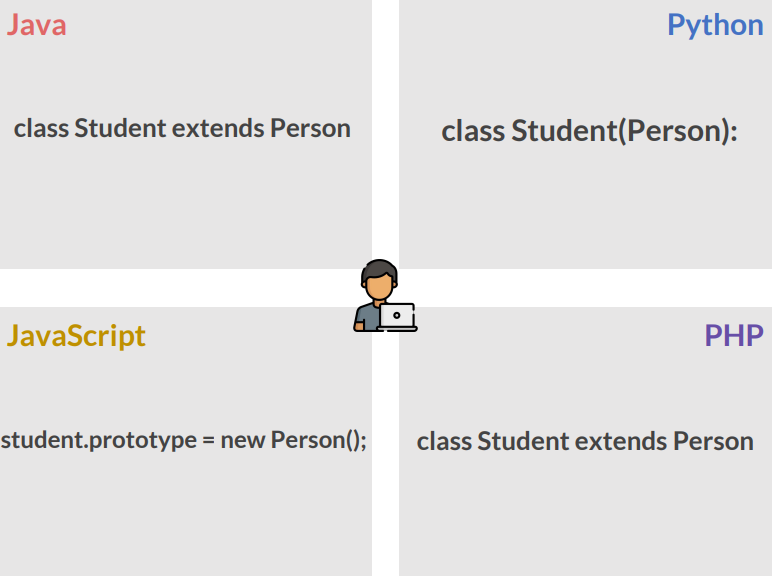
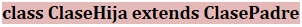
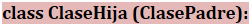
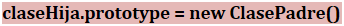
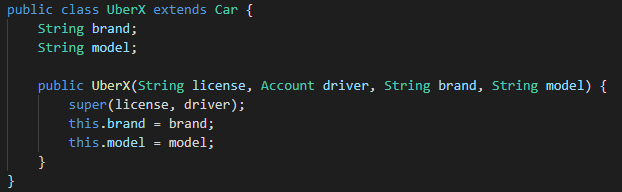
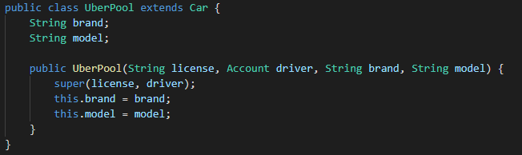
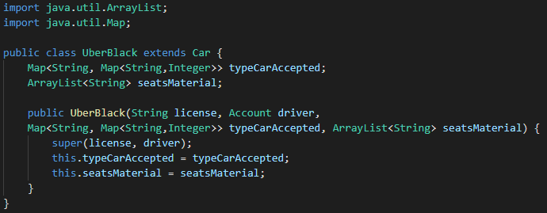
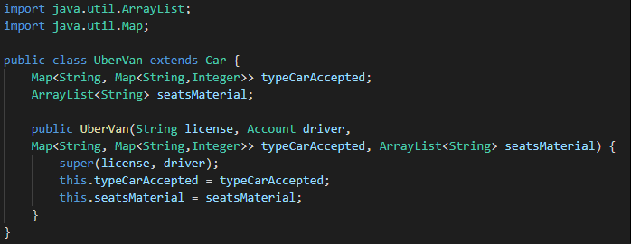
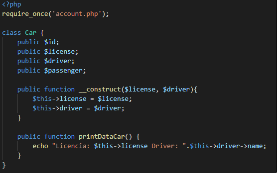
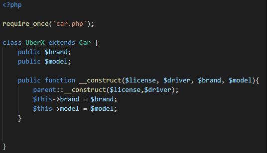

# Clase 25 _Aplicando herencia en lenguaje Java y PHP_

Ya sabemos cómo funciona la herencia de manera conceptual, pero aún lo hemos
visto expresada en código dependiendo del lenguaje de programación que elijas. Y
es que esto varía dependiendo de lo que estés eligiendo:

- **Java:** Para crear una subclase se usa la palabra reservada extends, esto le
  indica a la clase hija cual va a ser su clase padre.

  

- **Python:** Usamos la palabra class seguido del nombre de la clase hija, se la
  pone entre paréntesis pasamos la clase padre como parámetro.

  

- **JavaScript:** Ha sido nuestro amigo rebelde durante todo el curso, por lo
  que no es de extrañar que JavaScript herede de una manera peculiar y es que
  simplemente toma a la clase hija seguido de la palabra prototype e
  inmediatamente instancia la clase padre.

  

- **PHP:** Esté lenguaje maneja la herencia de manera similar a Java, usando la
  palabra extends.

**JAVA**

Siguiendo con la clase Car es tiempo de crear los objetos que descienden de
esté, para eso creamos cuatro archivos que serán nuestras clases UberX,
UberPool, UberBlack y UberVan.

UberX y UberPool

- Creamos las clases y usamos extends para señalar que estamos heredando de la
  clase Car, creamos los atributos propios y después creamos un constructor que
  reciba cuatros parámetros.
- **super():** sirve para llamar al constructor de la clase padre.

UberBack y UberVan

- Importamos el ArrayList y Map de la biblioteca java.util
- **Map:** Es una interfaz que define el conducta general de una estructura que
  se hace relación de clave/valor.
- Creamos las clases y usamos extends para señalar que estamos heredando de la
  clase Car, creamos los atributos propios y después creamos un constructor que
  reciba cuatros parámetros.
- **super():** sirve para llamar al constructor de la clase padre.

**PHP**

Al igual que en Java, también creamos cuatro archivos nuevos que serán nuestras
clases.

Tenemos nuestra clase Car:

Y ahora crearemos una clase UberX:

- **require_once:** Inserta en nuestro programa un código procedente de otro
  archivo, si el archivo no existe o contiene errores, nuestro programa no
  funcionará y obtendremos un fatal error.
- **extends:** Indicamos a la clase hija cual va a ser su clase padre.
- Los constructores padres no son llamados implícitamente si la clase hija
  define un constructor. Para ejecutar un constructor padre, se requiere invocar
  a **parent::__construct()** desde el constructor hijo. Si el hijo no define un
  constructor, entonces se puede heredar de la clase madre como un método de
  clase normal (si no fue declarada como privada).

**Reto 4**

- Termina las clases de PHP en Uber.
