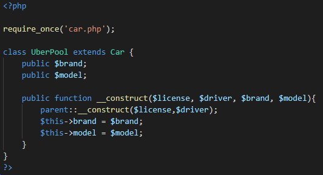
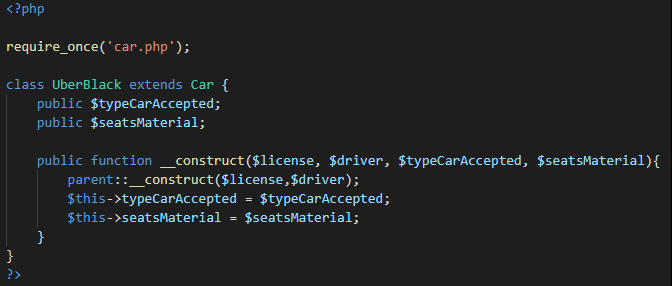
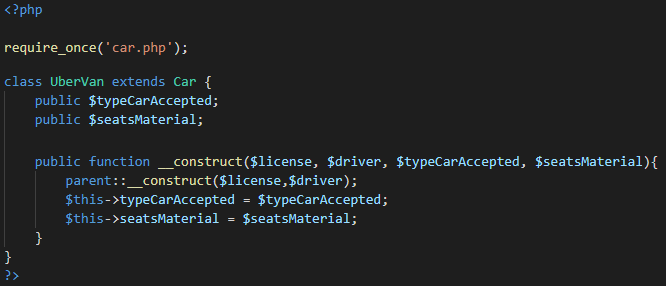
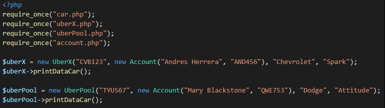
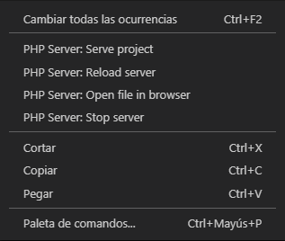
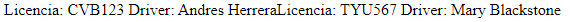

# Clase 26 *Solución del reto de herencia en PHP*

En la clase anterior nos quedamos con el reto de terminar la composición de las demás clases que heredan de Car, ahora vamos a ver lo que debimos haber hecho.

UberPool:

- **require_once:** Inserta en nuestro programa un código procedente de otro archivo, si el archivo no existe o contiene errores, nuestro programa no funcionará y obtendremos un fatal error.
- **extends:** Indicamos a la clase hija cual va a ser su clase padre.
- Los constructores padres no son llamados implícitamente si la clase hija define un constructor. Para ejecutar un constructor padre, se requiere invocar a **parent::__construct()** desde el constructor hijo. Si el hijo no define un constructor, entonces se puede heredar de la clase madre como un método de clase normal (si no fue declarada como privada).

Y, las clases UberBlack y UberVan:

- En el caso de UberBlack y UberVan existe una ventaja de que PHP no es estrictamente tipado, por lo que, a diferencia de Java en donde tuvimos que escribir toda la composición de la variable, en esta ocasión no es necesario.

Ahora vamos a probar nuestro código:

- Usando **require_once()** traemos las clases Car, UberX, UberPool y Account.
- El símbolo **$** seguido de un nombre representan a nuestras variables.
  
	- **$uberX, $uberPool:** Son los objetos de tipo UberX y UberPool respectivamente.

- Entre las paréntesis van las variables que aceptan cada clase

	- Primero va license (matricula), seguido del objeto Account que aceptan name (nombre) y document (documento), después va el brand (marca) del vehículo y finalmente el model (modelo).

- La sintaxis para llamar a un método en PHP es: ***$variable -> método().***

***Nota: Todavía no hemos ejemplificado en código la herencia de la clase Driver, pero con lo aprendido a estas alturas serías capaz de hacerlo por ti mismo.***

Finalmente para ejecutar nuestro código damos click derecho en algún lugar del editor y vamos en PHP Server: Serve project para arrancar un servidor.

Una vez hecho eso nos aparecer un navegador con los datos imprimidos.

Como vez, todavía no imprimimos los datos de la marca y modelo, pero eso lo estaríamos viendo más adelante.