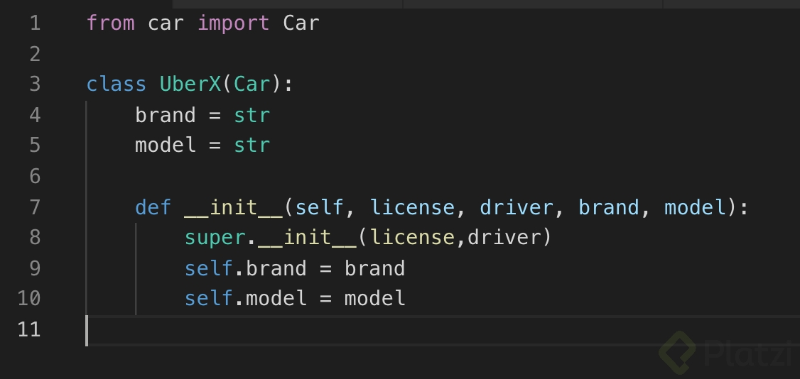
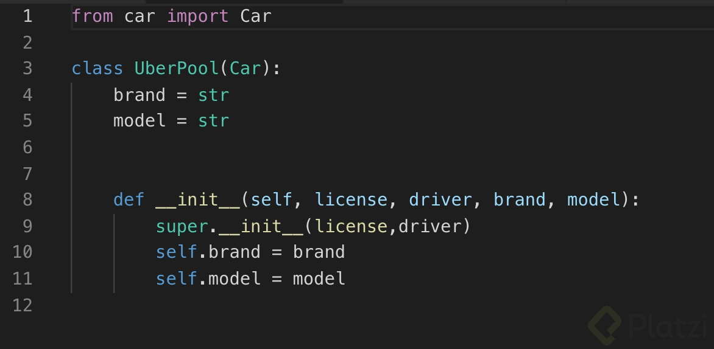
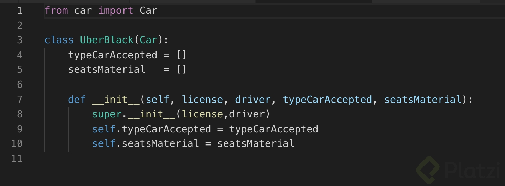
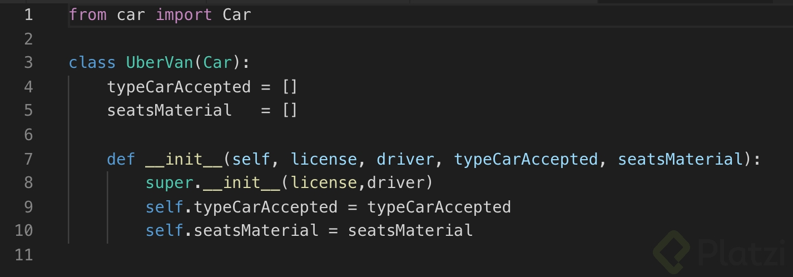
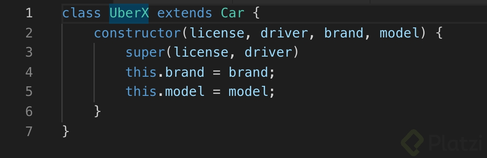
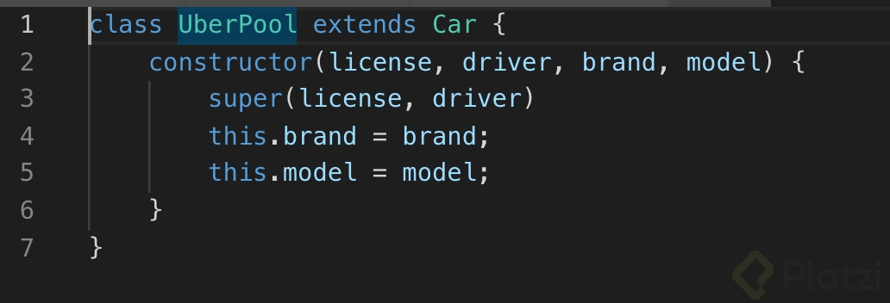
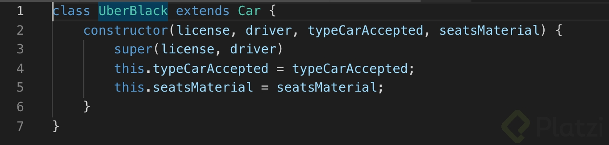
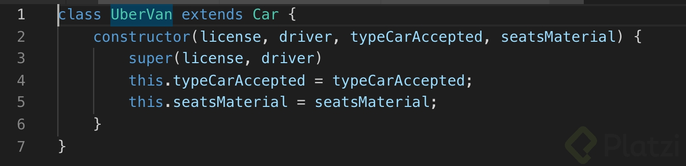
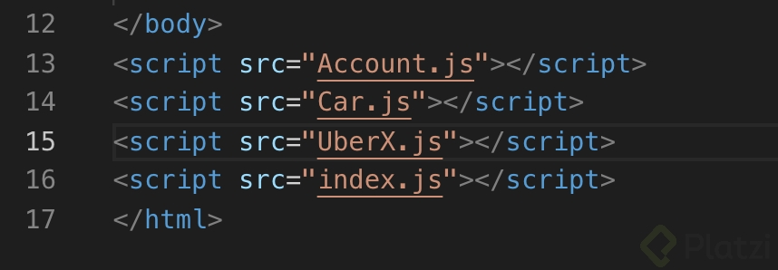
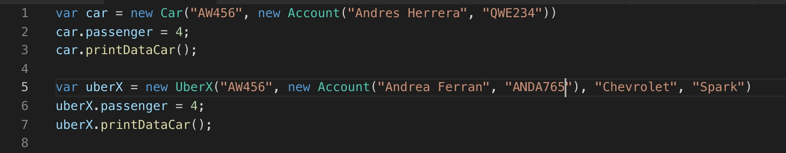

# Clase 27 *Aplicando herencia en lenguaje Python y JavaScript*

Recuerdas que en Python la herencia se expresa de manera muy similar a un método constructor de otros lenguajes. Apliquemos herencia para nuestra familia Car, para esto crearemos las siguientes clases:

- UberX.py
- UberPool.py
- UberBlack.py
- UberVan.py

El código completo puedes verlo [aquí](https://github.com/anncode1/Curso-POO-Platzi/tree/2cbdf9db470a98323328f8a21bf6a9de941d008e/Python "aquí")

**JavaScript**

En clases anteriores te expliqué cómo ejecutar herencia en estándares anteriores al ECMAScript 6. Uno de los beneficios de utilizar este nuevo estándar que ejecutar herencia es tan simple como utilizar la palabra reservada extends.

Ahora para utilizar una de las clases y crear un objeto, por ejemplo de UberX, no olvides declarar la clase en el archivo index.html.

Nuestro ejemplo se verá así:

El código completo puedes verlo [aquí]( https://github.com/anncode1/Curso-POO-Platzi/tree/9251101bdc2722ed13f9d93cb432ba8e9aba17b4/JS "aquí")