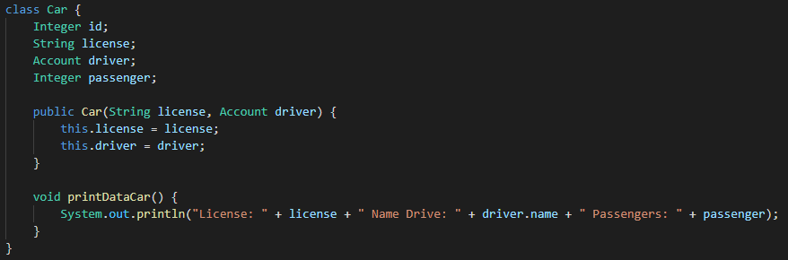
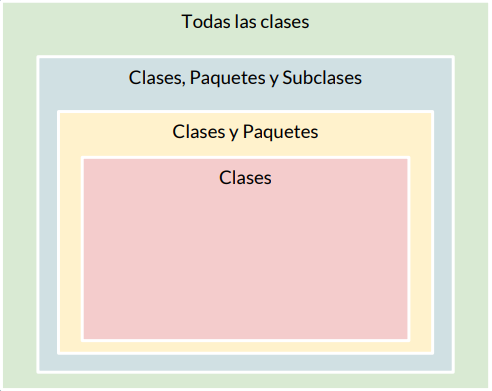

# Clase 30 _Encapsulamiento_

Ya casi estamos terminando nuestro proyecto y estamos dando los últimos detalles
que claro no son menos importantes porque aquí estaremos viendo las
restricciones que tendrá cada clase.

Recordemos nuestra clase Car ahora añadiremos para imprimir la cantidad de
pasajeros:

Mientras que la archivo Main definimos una variable de tipo UberX:

_**RECUERDA: UberX hereda de Car, por lo que tiene todos sus métodos y
atributos.**_

**¿Qué pasa si ejecutamos el programa?**

Pues no imprimirá la licencia, el nombre del conductor y la cantidad de
pasajeros que puede llevar. ¿Y si cambiamos passenger de 4 a 3? Pues nada
extraños, nos seguirá imprimiendo todo perfectamente.

Pero si lo meditamos un poco, las reglas de Uber dicen que los vehículo de
categoría UberX deben tener al menos cuatro pasajeros sin contar al conductor,
es decir, aceptan cinco personas dentro pero cuatro lugares deben quedar
disponible para ese vehículo. Entonces, si colocamos que passenger sea igual a
tres generara una inconsistencia en nuestros datos. Una inconsistencia que
podemos prevenir al hacer que nadie pueda alterar ese parámetro.

Y precisamente de eso trata nuestra clase de hoy: no alterar un parámetro, que
nadie más tenga acceso, y la única forma que tenemos en Java (y en la
programación orientada a objetos) será escondiendo ese parámetro, dejarlo
invisible o al menos invalidado para los demás implementando la encapsulación.

**Encapsulamiento**

Este concepto consiste en la ocultación del estado o de los datos miembro de un
objeto, de forma que sólo es posible modificar los mismos mediante los métodos
definidos para dicho objeto. Es decir, limitamos el acceso a las variables de
nuestras clases.

Y es justamente eso lo que nosotros deseamos hacer, esconder el atributo
passenger para que no pueda ser alterado o que al menos no le pongan datos que
ni siquiera tengan que ver con la lógica de nuestro negocio.

**¿Como se encapsulan los datos?**

Cuando realizamos un abstracción en una clase para luego instanciarla y crear un
objeto no se necesita conocer a fondo la implementación solo se necesita poder
instanciar esa clase tampoco necesita conocer todas las propiedades de un objeto
o acceder a ellas de forma directa, por ello podemos crear diferentes métodos y
forzar a utilizar métodos definidos para modificar estas propiedades.

Para realizar el proceso anterior se necesita conocer los modificadores de
acceso. Los modificadores de acceso permiten dar un nivel de seguridad mayor a
nuestras aplicaciones restringiendo el acceso a diferentes atributos, métodos,
constructores asegurándonos que el usuario deba seguir una "ruta" especificada
por nosotros para acceder a la información.

Es muy posible que nuestras aplicaciones vayan a ser usadas por otros
programadores o usuarios con cierto nivel de experiencia; haciendo uso de los
modificadores de acceso podremos asegurarnos de que un valor no será modificado
incorrectamente por parte de otro programador o usuario. Generalmente el acceso
a los atributos se consigue por medio de los métodos get y set, pues es
estrictamente necesario que los atributos de una clase sean privados.

Teniendo en cuenta la siguiente imagen:

- El recuadro verde hace referencia al modificador de acceso público
  (**public**). Es el más permisivo de todos, esto quiere decir que si el
  componente de una clase es public, tendremos acceso a él desde cualquier clase
  o instancia sin importar el paquete o procedencia de ésta.
- El recuadro azul hace referencia al modificador de acceso protegido
  (**protected**). Nos permite acceso a los componentes con dicho modificador
  desde la misma clase, clases del mismo paquete y clases que hereden de ella
  (incluso en diferentes paquetes).
- El recuadro amarillo hace referencia al modificador de acceso por defecto
  (**default**). Java nos da la opción de no usar un modificador de acceso y al
  no hacerlo, el elemento tendrá un acceso conocido como default, acceso por
  defecto, que permite que tanto la propia clase como las clases del mismo
  paquete accedan a dichos componentes (de aquí la importancia de declararle
  siempre un paquete a nuestras clases).
- El recuadro rojo hace referencia al modificador de acceso privado
  (**private**). Es el más restrictivo de todos, básicamente cualquier elemento
  de una clase que sea privado puede ser accedido únicamente por la misma clase
  por nada más. Es decir, si por ejemplo, un atributo es privado solo puede ser
  accedido por lo métodos o constructores de la misma clase. Ninguna otra clase
  sin importar la relación que tengan podrá tener acceso a ellos.
