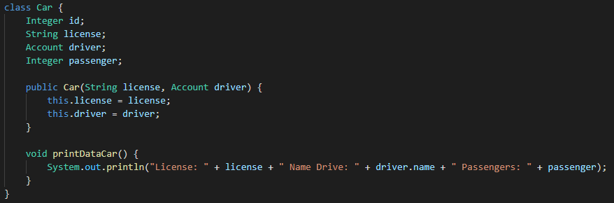
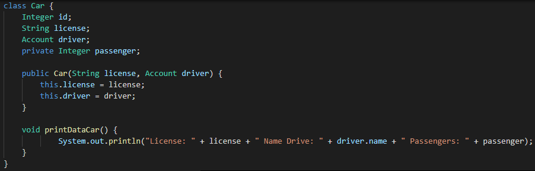
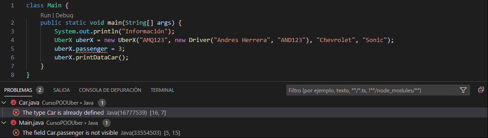
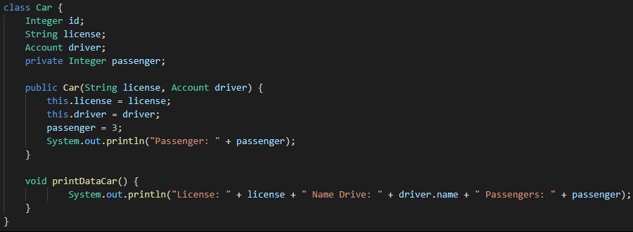
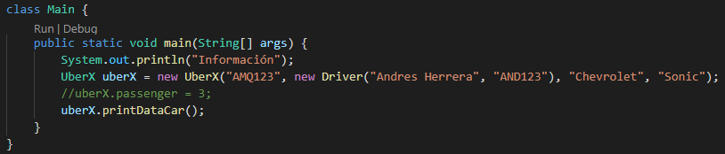
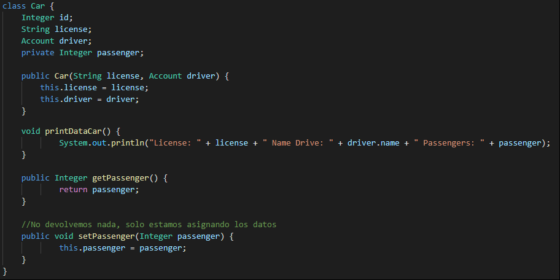
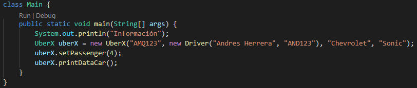
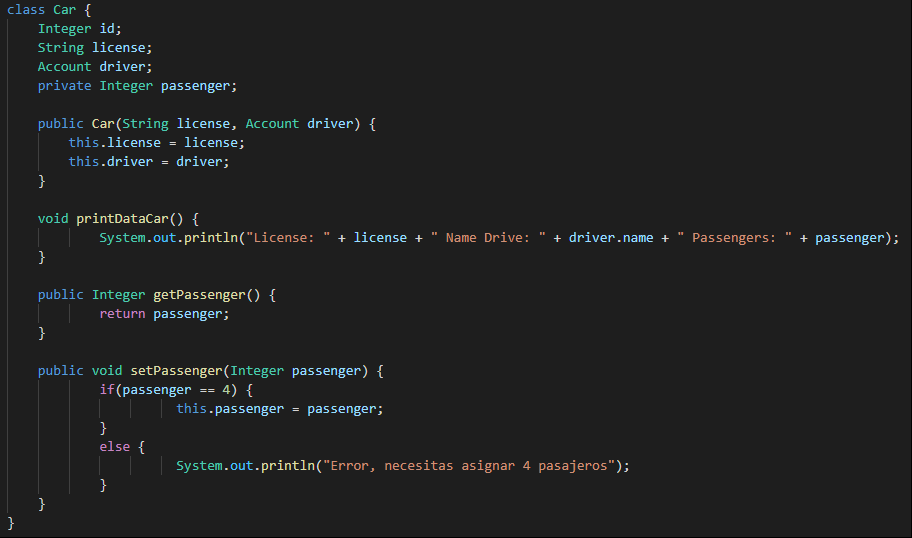

# Clase 31 *Encapsulando atributos en Java*

Ahora que ya entendimos sobre encapsulamiento y cuáles son los datos a encapsular vamos a hacerlo en nuestras clases.

Estamos en nuestro proyecto y quedamos que passenger sea validado, el hecho de que tuviera 3 lugares disponibles no es algo que va con la regla de nuestro negocio. Para eso vamos a arreglar esto poniendo un modificador de acceso en la clase Car. ¿Por qué la clase Car? Porque ahí precisamente es donde se encuentra nuestro atributo passenger y actualmente se ve así:

El atributo passenger no tiene ningún modificador, es decir, su acceso es default. Podemos escribir ***public Integer passenger;*** para que sea de acceso público, pero nosotros queremos esconderlo y que sea accesible únicamente para la clase, por lo que su modificador será private.

Entonces quedara de este modo:

Pero si lo ejecutamos nos saldrá error:

Y eso se a que el atributo passenger ya no se encuentra visible para la clase Main, pero si continua siendo visible para la clase Car. Por eso, si nosotros queremos, podemos imprimir passenger desde el constructor de la siguiente forma:

Los que hicimos fue en la clase Car, dentro del constructor, darle al atributo passenger un valor de 3 (asientos disponibles) y debajo imprimimos en pantalla. Mientras que en la clase Main simplemente eliminamos o comentamos nuestro acceso al atributo passenger. Si esto lo ejecutamos podemos ver cómo nos corre perfectamente, sin embargo, si lo intentamos correr directamente a través de Main nos dará error porque el atributo passenger es privado y solo visible dentro de su clase.

Ahora vamos a darle un poco de forma y sentido. ¿Por qué lo dejamos accesible dentro de la clase? Porque necesitamos validarlo, lo que nosotros deseamos es que cuando alguien quiera ingresar los datos sobre la cantidad de asientos disponibles definitivamente debe ser de cuatro para los de tipo UberX.

Por eso, y para acceder a los datos privados, usaremos métodos especiales.

Los métodos get y set, son simples métodos que usamos en las clases para mostrar (get) o modificar (set) el valor de un atributo. El nombre del método siempre será get o set y a continuación el nombre del atributo, su modificador siempre es public ya que queremos mostrar o modificar desde fuera la clase.

Agregando los métodos get y set a nuestro programa quedaría así:

Creamos los métodos getPassenger y setPassenger.

- **getPassenger:** Retorna nuestro atributo passenger.
- **setPassenger:** Asigna el valor similar a como lo hicimos dentro del constructor.

Con esos dos métodos creados, en la clase Main podemos acceder a setPassenger y por parámetro enviar el valor para passenger. Y si este código lo ejecutamos nos seguirá corriendo perfectamente. Podríamos pensar que es exactamente lo mismo solo que cambiamos la variable por un método, pero no es así. Ahora seremos capaces de validar los valores enviados a passenger para que no permitir que ningún otro valor diferente a cuatro sea agregado o incluso enviar un parámetro vacío.

Dentro del método setPassenger validamos para que el valor del atributo passenger siempre sea cuatro, en caso de que se ingrese otro, entonces nos marcara error. Con esto ya todos los futuros conductores estarán obligados a poner cuatro asientos disponibles para que les funcione la aplicación.

Incluso podríamos validar los datos dentro de printDataCar para que todos atributo sean diferente a null, es decir, que siempre tengan un valor.