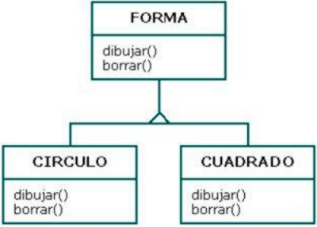
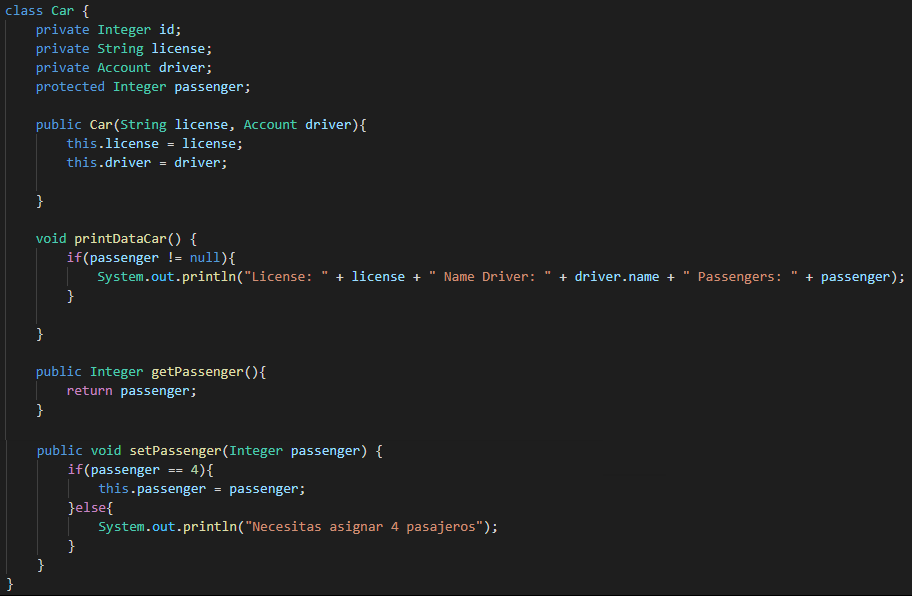
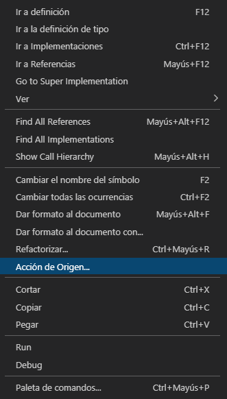
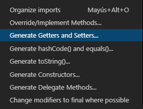
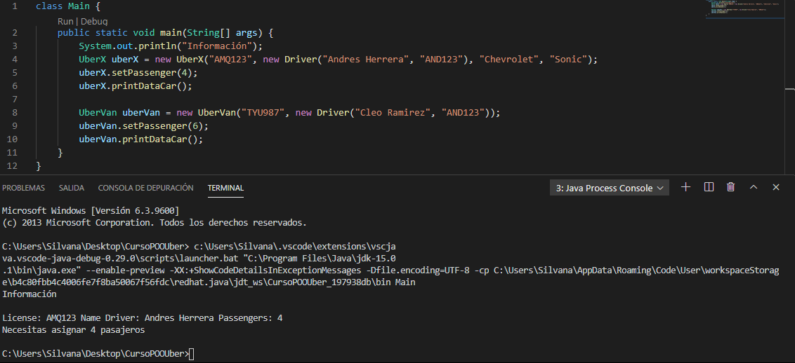
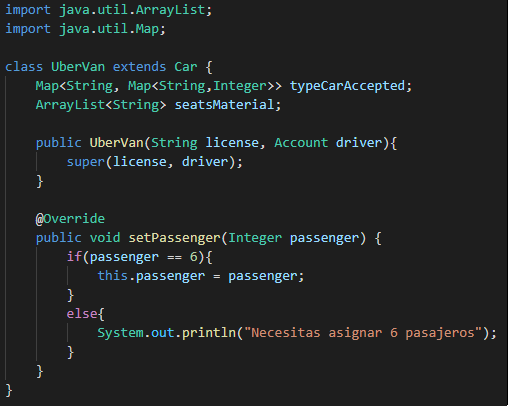
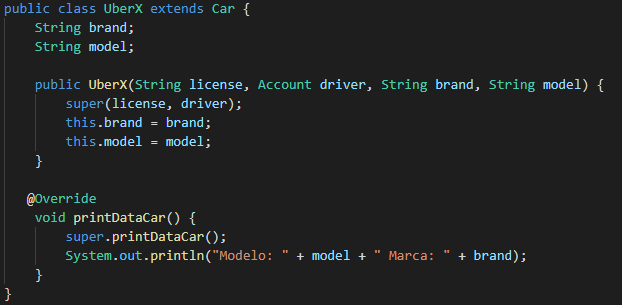
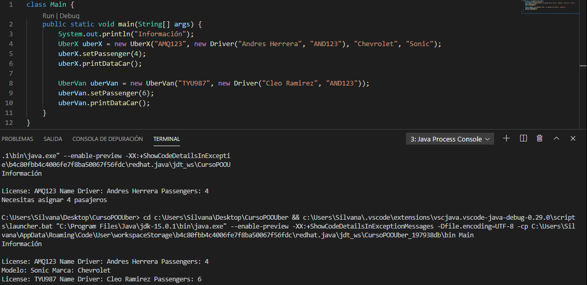

# Clase 32 _Generando polimorfismo en Java_

Polimorfismo: Muchas formas. Poli = muchas, morfismo = formas. NO es
Poliformismo

Es construir métodos con el mismo nombre pero con comportamiento diferente

Estamos llegando casi al punto final de nuestro proyecto y es momento de ver una
de las partes más importantes, una pieza fundamental para nuestro proyecto, que
es el polimorfismo.

**Polimorfismo**

Viene de «Poli» que significa mucho y «Morfismo» que significa formas, es decir,
muchas formas.

_**Observación: No es Poliformismo como algunos lo llaman.**_

El polimorfismo es la capacidad que tienen los objetos de una clase en ofrecer
respuesta distinta e independiente en función de los parámetros (diferentes
implementaciones) utilizados durante su invocación. Dicho de otro modo el objeto
como entidad puede contener valores de diferentes tipos durante la ejecución del
programa.

En JAVA el término polimorfismo también suele definirse como 'Sobrecarga de
parámetros', que así de pronto no suena tan divertido pero como veremos más
adelante induce a cierta confusión. En realidad suele confundirse con el tipo de
poliformismo más común, pero no es del todo exacto usar esta denominación.

Por lo general diremos que existen 3 tipos de polimorfismo:

- **Sobrecarga:** El más conocido y se aplica cuando existen funciones con el
  mismo nombre en clases que son completamente independientes una de la otra.
- **Paramétrico:** Existen funciones con el mismo nombre pero se usan diferentes
  parámetros (nombre o tipo). Se selecciona el método dependiendo del tipo de
  datos que se envíe.
- **Inclusión:** Es cuando se puede llamar a un método sin tener que conocer su
  tipo, así no se toma en cuenta los detalles de las clases especializadas,
  utilizando una interfaz común.

Un ejemplo clásico que podemos ver es esta:

En la que tenemos una jerarquía de clases donde nuestra clase padre se llama
Forma y sus clases hijas son Circulo y Cuadrado.

Las clases pueden compartir atributos y métodos, como ya hemos aprendido en
clases anteriores, pero en este caso particular el Circulo va a dibujar de una
forma distinta al Cuadrado. Esto es un comportamiento diferente que tiene el
Circulo con respecto al Cuadrado, pero ese método dibujar proviene de la clase
padre por lo que puede que se le haya dado un comportamiento por defecto o
incluso puede que solo se haya dejado en blanco para que cada quien implemente
el comportamiento que así lo desea, esto específicamente es lo que llamamos
polimorfismo es donde tenemos un método que se comparte entre clases y cada una
de esas clases le da el comportamiento que necesita o que desea.

Ahora vamos a nuestro proyecto y analicemos un momento. Ya hemos encapsulado y
validado la variable passenger para que acepte únicamente el valor de 4, y
entendemos que el método setPassenger puede variar dependiendo de cada clase. En
este caso las clases UberX, UberPool y UberBlack aceptaran cuatro como la
cantidad de asientos disponibles, pero con UberVan nos surge la necesidad de
validar el dato a seis lugares disponibles, esa es la condición que nos pone
Uber para tener un auto de tipo UberVan en la plataforma. Entonces es ahí, en
UberVan, donde tenemos un comportamiento diferente.

El comportamiento involucra la asignación del dato, la validación del dato para
seis en lugar de cuatro, y aquí ya estamos viendo impregnado el polimorfismo.

Vamos en nuestra clase Car:

Encapsulamos todos nuestros demás datos, además de cambiar el modificador de
acceso de Passenger y lo volvemos protected para que pueda ser usada por las
subclases.

Después, con un click derecho, seleccionamos Source Action o Acción de Origen:

Y luego elegimos «Generate Getters and Setters»:

Esto nos trae automáticamente todos los getters y setters de todos los atributos
que encapsulamos.

Entonces, la validación para que los asientos disponibles sea 4 ya queda
heredado para las clases Car, UberX, UberPool y UberBlack, pero en el caso de
UberVan es diferentes. Creemos un objeto de tipo UberVan y veamos que sucede.

Por el bien del ejemplo hemos cambiado el constructor de UberVan por uno más
sencillo para poder manipular mejos los datos, pero igualmente podemos ver
cuando enviamos 6 como la cantidad que debe tener passenger no nos imprime
ningún resultando, incluso cuando imprime nuestro objeto UberX, y nos dice que
debemos poner 4 pasajero lo cual no es el dato que nosotros queremos que tenga.

Para arreglar esto vamos a la clase UberVan:

**¿Para qué sirve @Override?**

Pues no sirve para nada. El uso de la anotación @Override es opcional.

Para lo único que realmente sirve es a modo de documentación:

- Un método marcado con @Override debería estar sobreescribiendo un método de
  alguna clase padre.
- Si esto no es así, el compilador de java generará un error

En este caso nosotros estamos trayendo el método setPassenger y usamos el
polimorfismo de sobrecarga para cambiar la validación, es decir, sobre
escribimos sobre el método para que tenga un nuevo comportamiento. En este caso,
nuestra validación pasa de aceptar 4 a aceptar 6.

También podemos usarlo en UberX:

En el caso de UberX nosotros traemos al método printDataCar y, aparte de decirle
con **super.printDataCar()** que nos imprima lo normal (licencia, nombre y
documento), también hacemos que nos imprima la marca y el modelo del vehículo.

Ahora, sí ejecutamos el código, podemos ver cómo nos imprime perfectamente tanto
los datos del UberX como del UberVan:

